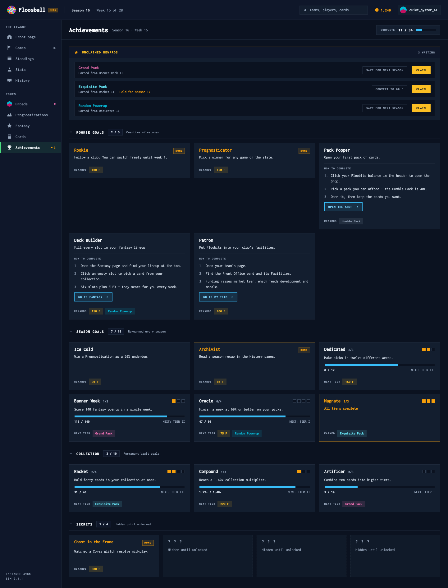
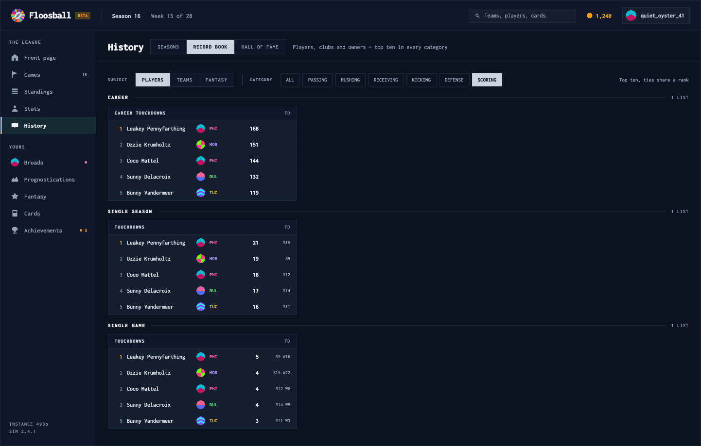
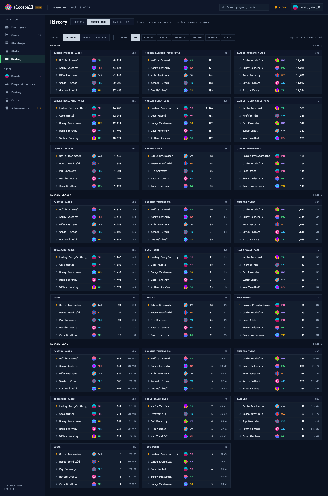
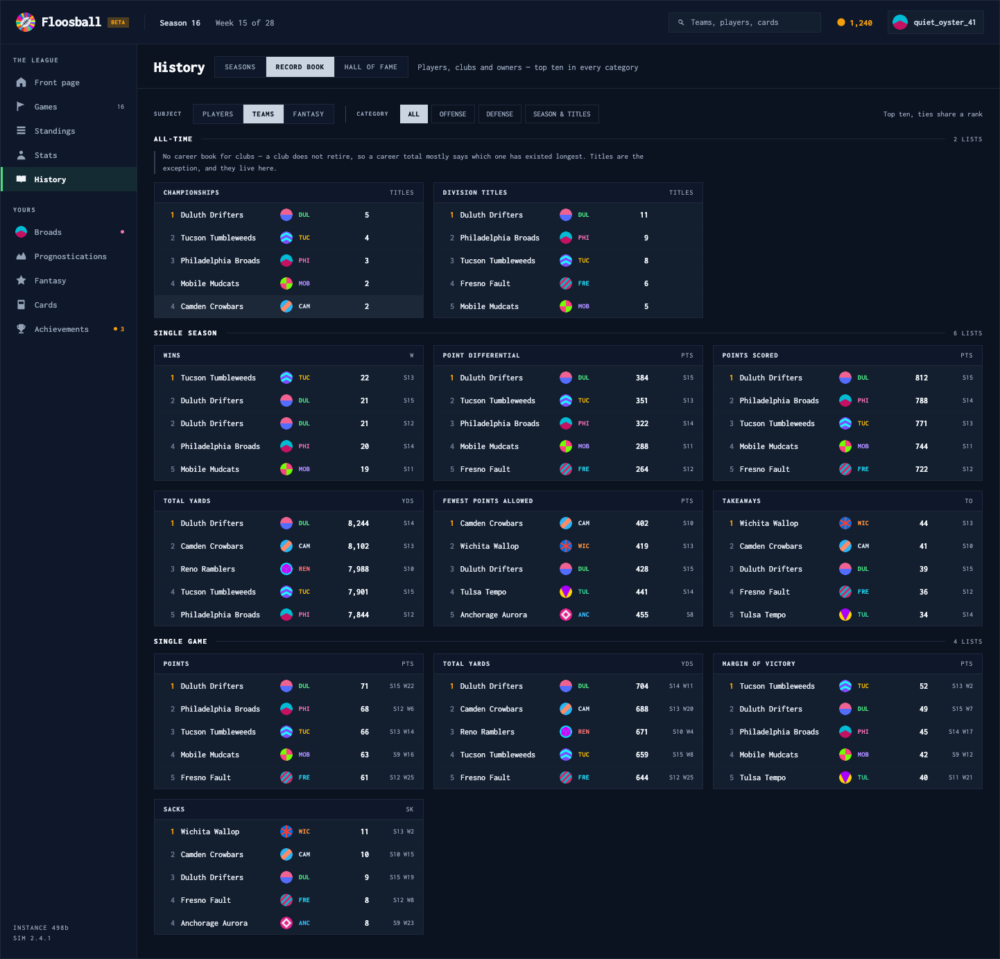
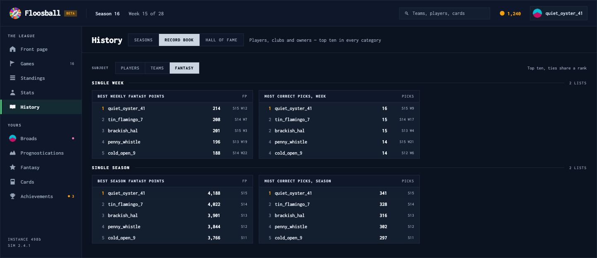
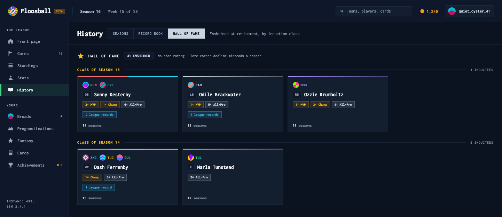

# Handoff: Achievements and History — restyled onto the house system

## Overview

Both pages predate the current visual system. `AchievementsPage.tsx` and `HistoryPage.tsx` still carry
8–10px radii, two competing blues (`#3b82f6` progress, `#60a5fa` tabs), `#1e293b`/`#1e2d3d` cards on a
`#0f172a` page, rounded pills, and per-category hard-coded card heights. Everything else in the app —
front page, standings, stats, team page, player profile — has moved to squared `#131e2f` panels on
`#0b1220` with `#0f172a` chrome headers, one `#38bdf8` accent, and the 10/700/0.1em label scale.

**This is a restyle, not a redesign.** The information architecture of both pages is kept as it is,
with two exceptions on History, both requested:

1. The **Record Book is regrouped**: scope (`CAREER` / `SINGLE SEASON` / `SINGLE GAME`) becomes the
   section header running down the page, and **category** (passing, rushing, receiving, kicking,
   defense, scoring) becomes a filter chip row. The old shape put scope in a pill row and let ~25
   category cards run as one undifferentiated grid.
2. **Fantasy returns as the third subject** of the Record Book (it is commented out in `SUBJECTS`
   today pending the backend fix — see **Data**).

**Deliberately unchanged:** every achievement section and its contents, the onboarding hint copy,
pending-reward actions and the stash rule, the seasons/champion/MVP/standings composition, and the
Hall of Fame's structure. HoF plaques are restyled only (flat panel, team-colour top rule) — the owner
signed off on the current plaque content as-is.

## About the design files

`prototype/Achievements and History.dc.html` is a **design reference created in HTML** — intended look
and behaviour, not production code. One static file, fixture data, inline styles. Open it in a browser;
no server needed.

It shows one turn with two screens stacked: **`1a` Achievements** and **`1b` History**. They are not
alternatives — they are the two pages.

The Floosball header and the 196px left rail are a **mock of app chrome that already exists**
(`AppHeader`, `AppNav`). Do not rebuild them. Nav icon paths are copied from `AppNav.tsx` verbatim.

**Interactive in the prototype:** the three History tabs, the `PLAYERS / TEAMS / FANTASY` subject
switch, the category chips, the season picker, and the four achievement section collapse toggles.

## Fidelity

**High-fidelity.** Colours, type sizes, weights and spacing below are final. Two things are content,
not design: the fixture rows show **five** entries per record list (ship ten, as today), and the
standings table shows ten of 32 clubs.

---

## Screens

### 1a — Achievements



Page head — `padding: 17px 24px 15px; border-bottom: 1px solid #1e293b`: `Achievements` at
`22px/800/−0.025em`, the season line at `12px/400/#94a3b8`, then right-aligned a completion plate
(`COMPLETE`, `11 / 34`, and a 64×5px `#0b1220` track with a `#38bdf8` fill). The plate is new; it
replaces nothing, and it is the only page-level total.

Body — `padding: 22px 24px 34px; gap: 28px`:

1. **Unclaimed rewards** — `#131e2f` panel with a `1px solid rgba(245,158,11,0.5)` border and a
   `#0f172a` header (`UNCLAIMED REWARDS` in `#fbbf24`, count right). Each row is a `#0b1220` plate:
   label in the pack/powerup colour, source line beneath, then the actions right-aligned —
   `SAVE FOR NEXT SEASON` and `CONVERT TO n F` as ghost plates (`1px solid #334155`), `CLAIM` as the
   one filled `#fbbf24` plate on the page. Held rewards append `· Held for season n` in amber.
2. **Four sections**, each a collapse button whose header is a `+`/`−` glyph, the title at
   `12px/800/0.12em`, a count plate (`#0f172a`, `1px solid #1e293b`), and the subtitle — with a
   `1px #1e293b` rule under the row. Collapse state persists per section (`localStorage`, as today).
   - `ROOKIE GOALS` — three-column grid, `align-items: start`. Incomplete cards carry the
     `HOW TO COMPLETE` step list and a `#38bdf8` action plate; completed cards size to their content.
     **The fixed 340px/170px card heights are gone** — the grid equalises rows, and `align-items:
     start` keeps a two-line completed card from stretching to a step-bearing neighbour.
   - `SEASON GOALS` — singles first, then tiered families. A family card carries tier **squares**
     (9×9, `#f59e0b` filled / `#0b1220` with a `#334155` border), `done/total`, the next tier's
     description, a 6px progress bar, `current / target` left and `NEXT: TIER n` right, and the next
     tier's reward chips pinned to the bottom. A completed family shows `All tiers complete` and its
     chips relabel to `EARNED`.
   - `COLLECTION` — identical family card, `NEXT TIER` reward label.
   - `SECRETS` — four-up. Locked cards are a `1px dashed #26313f` panel on `#101a29` with `? ? ?` at
     `0.16em` tracking; unlocked cards match a completed achievement card.

Reward chips are square, `11px/700`, colour on a `colour+20` field: Floobits `#fbbf24`, powerups
`#06b6d4`, packs in their shop colours (`humble #94a3b8`, `grand #f472b6`, `exquisite #67e8f9`).

### 1b — History, Seasons



Tabs move out of the pill row and up **beside the title** as one squared segmented control
(`SEASONS / RECORD BOOK / HALL OF FAME`; active `#cbd5e1` field with `#0b1220` text), with a
one-line note for the active tab where the old subtitle was.

`grid-template-columns: 220px minmax(0,1fr); gap: 20px; align-items: start`.

- **Season picker** — panel with a `COMPLETED SEASONS` chrome header; each row is `Season n` plus the
  champion's crest and abbr, the active row taking a `3px #f59e0b` left rule on `#0b1220`.
- **Champion / MVP band** — one panel split by a `1px #1e293b` vertical rule: `FLOOSBOWL n CHAMPION`
  with the club in its own colour at `20px/800` and its record, and `MOST VALUABLE PLAYER` with the
  name at `17px/700`, a position plate, and the season line.
- **Final standings** — the stats-page table shell: `#0f172a` header, `10px/700/0.1em` column labels,
  `12px` tabular cells, `1px #16202f` row rules, `rgba(255,255,255,0.04)` row hover. Columns are
  `# / CLUB / W / L / PCT / ELO / RESULT`; `RESULT` is new and carries the postseason finish
  (`CHAMPION` amber, `RUNNER-UP`, `SEMIFINAL`, `WILD CARD`, else `—`).

### 1b — Record Book





Control row: `SUBJECT` switch (`PLAYERS / TEAMS / FANTASY`), a `1px #334155` divider, then `CATEGORY`
chips, then `Top ten, ties share a rank` right-aligned.

Below it, one section per scope: a `11px/800/0.14em` label, a hairline rule, and the list count
(`9 LISTS`) on the right — the same header pattern the Hall of Fame classes use. Each section holds
its own `repeat(auto-fill, minmax(370px, 1fr))` grid of list cards. A card is a panel with a
`#0f172a` header (category label left, unit right — `YDS`, `TD`, `TKL`, `SK`, `FG`, `PTS`, `FP`,
`PICKS`) and rows of `rank / name / crest / abbr / value / when`.

The **370px minimum is load-bearing** and unchanged from today: rank(16) + crest(18) + abbr(30) +
value(62) + when(56) + five 9px gaps + 26px padding leaves the name its real width. Do not lower it.

Per subject:

- **Players** — `CAREER`, `SINGLE SEASON`, `SINGLE GAME`. Categories: `ALL`, `PASSING`, `RUSHING`,
  `RECEIVING`, `KICKING`, `DEFENSE`, `SCORING`.
- **Teams** — no career section. Instead an `ALL-TIME` section holding `CHAMPIONSHIPS` and
  `DIVISION TITLES`, with the reasoning stated in a note under the header ("a club does not retire, so
  a career total mostly says which one has existed longest; titles are the exception"). The old design
  expressed this by silently omitting a pill. Categories: `ALL`, `OFFENSE`, `DEFENSE`,
  `SEASON & TITLES`.
- **Fantasy (owners)** — `SINGLE WEEK` (`BEST WEEKLY FANTASY POINTS`, `MOST CORRECT PICKS, WEEK`) and
  `SINGLE SEASON` (`BEST SEASON FANTASY POINTS`, `MOST CORRECT PICKS, SEASON`). Owner rows have no
  club, so the crest and abbr cells are **absent**, not blank. No category row — the subject has one
  category.

### 1b — Hall of Fame



Structure and content unchanged: a header with the enshrined count, then one group per induction class
(newest first) with a `#fbbf24` class label, hairline rule and inductee count, then a
`repeat(auto-fill, minmax(252px, 1fr))` grid of plaques.

Plaques are restyled only: the `linear-gradient(160deg, #233149, #18222f)` field, 10px radius, drop
shadow, inset highlight and laurel watermark all come out; what remains is a `#131e2f` panel with a
`3px` team-colour top rule (one hard-stop segment per club, as today), crest+abbr row, position plate,
name at `15px/700`, square award badges (`n× MVP` `#fbbf24`, `n× Champ` `#f59e0b`, `n× All-Pro`
`#cbd5e1`, each on `colour+1a` with a `colour+44` border), the league-records pill in `#38bdf8`, and
the seasons line pinned to the bottom. No star rating — unchanged, and for the same reason.

---

## Interactions & Behavior

- **Achievement sections** — collapse per section, persisted under
  `achievements-section:<storageKey>`. Unchanged.
- **Tiered families** — the summary card is the default; expanding to per-tier cards is unchanged.
- **Record Book** — subject and category are page-local state. Switching subject resets the category
  to `ALL` (the category sets differ per subject). A category with no lists in a scope removes that
  **section**, not just its cards — never render an empty section header.
- **Ranking** — golf-style ties throughout (a tie shares a rank, the next distinct value skips ahead).
  Unchanged, and it must stay identical between the player, team and owner books.
- **Team colour on text** — always through `readableTeamColor(color, '#131e2f')`. Club colours are
  data and several are navy or maroon. Note the background argument changed with the panel colour.
- **Hover** — table and list rows `rgba(255,255,255,0.04)`; plates take `border-color: #475569` and
  `background: #1b2739`; chips take `border-color: #64748b` and `color: #f1f5f9`.
- **Focus** — `outline: 2px solid #38bdf8; outline-offset: 2px` on tabs, switches, chips and plates.
- **Empty states** — no unclaimed rewards → the panel is absent. No secrets → the section is absent.
  An empty record scope → that section is absent. The existing "no records yet" and "the hall is
  empty" messages keep their copy at `#94a3b8`.
- **Responsive** — designed at 1440px. Below ~1100px the Seasons grid stacks (picker above detail) and
  the achievement grids drop to two columns, then one; the record grids fall to one column at their
  370px floor; the standings table scrolls horizontally with the club cell pinned.

## State Management

```ts
// AchievementsPage — unchanged, plus nothing new
collapsed: Record<string, boolean>          // localStorage-backed, per section

// HistoryPage
mode:    'seasons' | 'records' | 'hall-of-fame'
subject: 'players' | 'teams' | 'fantasy'    // fantasy re-enabled
category: 'all' | 'passing' | 'rushing' | 'receiving' | 'kicking' | 'defense' | 'scoring'
        | 'offense' | 'season'              // team sets
season:  number                             // selected season
```

`RecordTab` (`'game' | 'season' | 'career'`) is **no longer a control** — the scope is the section, so
all scopes render at once and the state goes away. `category` replaces it.

---

## Data

No new endpoints. Three changes, all small.

### A. Category on each record

`GET /api/history/records` and `/api/history/team-records` already return
`records[scope][categoryKey]` plus a `labels` map. The grouping needs one more map so the frontend
does not parse category keys with a regex:

```ts
interface RecordsResponse {
  records: { game: …, season: …, career: … }
  labels:  Record<string, string>   // existing: key → display label
  groups?: Record<string, string>   // NEW: key → 'passing' | 'rushing' | 'receiving'
                                    //           | 'kicking' | 'defense' | 'scoring'
                                    //           | 'offense' | 'season'
}
```

If `groups` is absent the frontend must fall back to showing every list under `ALL` and hiding the
chip row — a missing map degrades to today's behaviour rather than an empty page.

### B. Team all-time titles

The `ALL-TIME` team section needs two lists that `team-records` does not return today:

```ts
records.allTime: {
  championships:   TeamRecordEntry[]   // from teams.championships
  divisionTitles:  TeamRecordEntry[]   // from teams.division_titles (season-stamped already)
}
```

Both are counting records off columns that exist. If the key is absent, drop the section.

### C. Fantasy records — the endpoint fix must land first

`GET /api/history/user-records` **500s on the deployed backend**: it parses
`weekly_card_bonuses.breakdowns_json` and iterates the result directly, walking the keys of the
current dict shape instead of the breakdown list. The fix is merged to main and not deployed, which is
why `'fantasy'` is commented out of `SUBJECTS` in `HistoryPage.tsx`.

Re-enabling the subject is the whole revert (`UserRecordsView` was deliberately left in place), but
it needs two additions to the payload for the design above:

```ts
interface UserRecordsResponse {
  weeklyFP:      UserRecordEntry[]   // existing
  seasonFP:      UserRecordEntry[]   // existing
  weeklyPicks?:  UserRecordEntry[]   // NEW — most correct picks in a week
  seasonPicks?:  UserRecordEntry[]   // NEW — most correct picks in a season
}
```

Both derive from the pick-em tables that already back the Prognostications leaderboard. Render only
the arrays that arrive; a subject with one list is fine, a subject with none should not offer the tab.

**Do not ship the FANTASY switch before the endpoint is deployed.** A 500 behind a visible tab is
worse than the tab being absent, which is the judgement that pulled it in the first place.

---

## Design Tokens

| Token | Value | Use |
| --- | --- | --- |
| Page background | `#0b1220` | content area, row plates inside panels |
| Panel | `#131e2f` | every card, table and list panel |
| Chrome | `#0f172a` | panel headers, table headers, count plates, position plates |
| Locked panel | `#101a29` | masked secret cards only |
| Border | `#1e293b` | panel borders, internal rules, dividers |
| Border faint | `#16202f` | table and list row rules |
| Border dashed | `#26313f` | masked secret border |
| Border strong | `#334155` | ghost-plate borders, control dividers, note rules |
| Border hover | `#475569` | plate hover |
| Text primary | `#f8fafc` / `#f1f5f9` | page title, panel titles, record values |
| Text body | `#cbd5e1` | descriptions, stat cells, card labels |
| Text secondary | `#94a3b8` | labels, column headers, units, inactive controls — **the floor for readable text** |
| Accent — progress/selection | `#38bdf8` | progress fills, action plates, records pill, focus ring |
| Accent — earned | `#f59e0b` / `#fbbf24` | DONE badges, tier squares, rank 1, class labels, CLAIM |
| Active nav | `#4ade80` on `rgba(74,222,128,0.10)` | left-rail active item |
| Active control | `#cbd5e1` field, `#0b1220` text | tabs, subject switch, active category chip |
| Rank 1 / other ranks | `#f59e0b` / `#64748b` | list rank column |
| Pack colours | `#94a3b8` / `#f472b6` / `#67e8f9` | humble / grand / exquisite — mirror `CardShop` |
| Powerup / Floobits | `#06b6d4` / `#fbbf24` | reward chips |

Type — one family, `font-pixel` (`pressStart` / Inconsolata, already global):

| Role | Size / line-height / weight / tracking |
| --- | --- |
| Page title | 22 / 1 / 800 / −0.025em |
| Section header (scope, class, achievement section) | 11–12 / 1 / 800 / 0.12–0.14em |
| Panel / list header | 10 / 1 / 800 / 0.12em |
| Column header, unit, group label | 10 / 1 / 700 / 0.1em |
| Card title (achievement, family, inductee) | 14–15 / 1 / 700 |
| Champion name | 20 / 1 / 800 / −0.02em |
| Body copy, description | 12 / 1.5 / 400 |
| Stat / record value | 12 / 1 / 700 tabular |
| Stat cell | 12 / 1 / 500 tabular |
| Reward chip, award badge | 10–11 / 1 / 700 |
| Small label, note | 11 / 1 / 400 |

Spacing: `4, 5, 6, 7, 9, 10, 11, 12, 13, 14, 16, 22, 24, 28` px. Progress bars are 6px, the completion
plate's bar 5px, plaque top rules 3px, tier squares 9px. **Radius 0 everywhere** except crests and
avatars (`50%`). **No shadows and no gradients** — the only gradient left is the plaque top rule, which
encodes multiple clubs.

## Conformance notes

1. Every readable string bottoms out at `#94a3b8`. `#475569` and below are borders only — this is what
   the old `#64748b` step numbers and `#475569` locked-secret copy violated.
2. One accent for progress and selection (`#38bdf8`). The old page used `#3b82f6` for bars and
   `#60a5fa` for tabs; both go.
3. No emoji and no icon fonts. `react-icons` comes out of these two pages: the trophy, laurel, star,
   book and chevrons are inline SVG on the 20-box (`AppNav`'s `ICON` convention).
4. No fixed card heights. Equal heights come from the grid row; `align-items: start` where a section
   mixes tall and short cards.
5. Card grids are `repeat(3, minmax(0,1fr))` for achievements (a fixed column count keeps the reward
   rows aligned across a row) and `auto-fill, minmax(370px, 1fr)` for record lists.

## Files

- `prototype/Achievements and History.dc.html` — the design, screens `1a` and `1b`.
- `prototype/assets/`, `prototype/support.js` — what the prototype needs to open.
- `screenshots/01-achievements.png` — screen 1a.
- `screenshots/02-history-seasons.png`, `03-record-book-players.png`,
  `04-record-book-teams.png`, `05-record-book-fantasy.png`, `06-hall-of-fame.png` — screen 1b, one per
  tab state.

In the target repo:

- `src/Views/Achievements/AchievementsPage.tsx` — restyle in place. `Section`, `AchievementRow`,
  `TieredFamilySummary`, `SecretRow`, `RewardChip`, `RewardLabel` and `PendingRewardsSection` all keep
  their shape; only their styles change, plus the removal of the `height` props.
- `src/Views/History/HistoryPage.tsx` — restyle, and rebuild `RecordBook` around scope sections;
  re-add `'fantasy'` to `SUBJECTS` **after** the endpoint deploys.
- `src/Views/Players/HallOfFame.tsx` — restyle `Plaque` only; leave its content and grouping alone.
- `src/Components/Shell/tokens.ts` — the token table above should be read from here, not re-declared.
  `BG.panel` is `#0f172a` today; these pages need the `#131e2f` panel and `#0b1220` page pair the rest
  of the app uses.
- `src/utils/colors.ts` — `readableTeamColor`; the background argument becomes `#131e2f`.
- `CLAUDE.md` — house conventions. The "no fixed card heights" and "one accent" rules belong there if
  they are not already.
