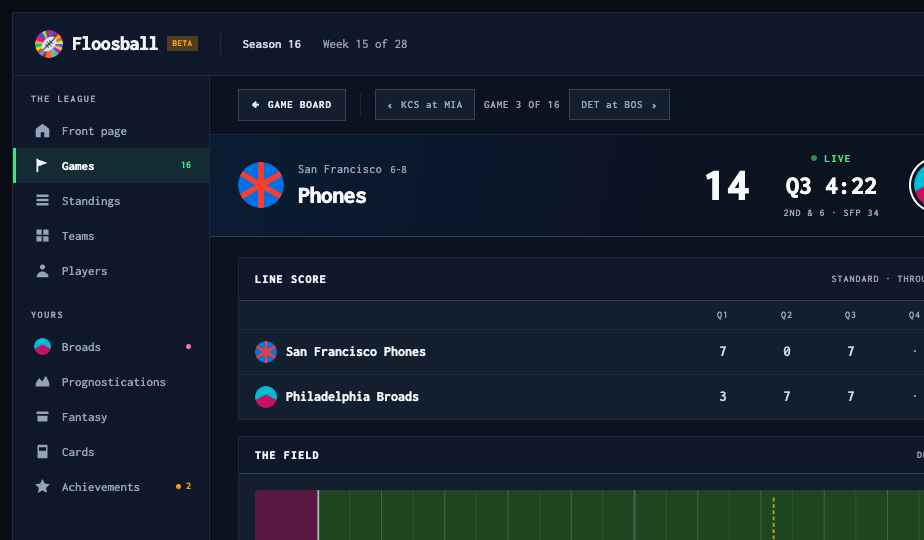
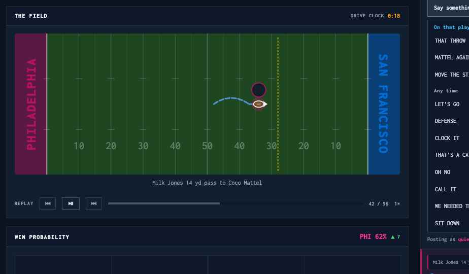
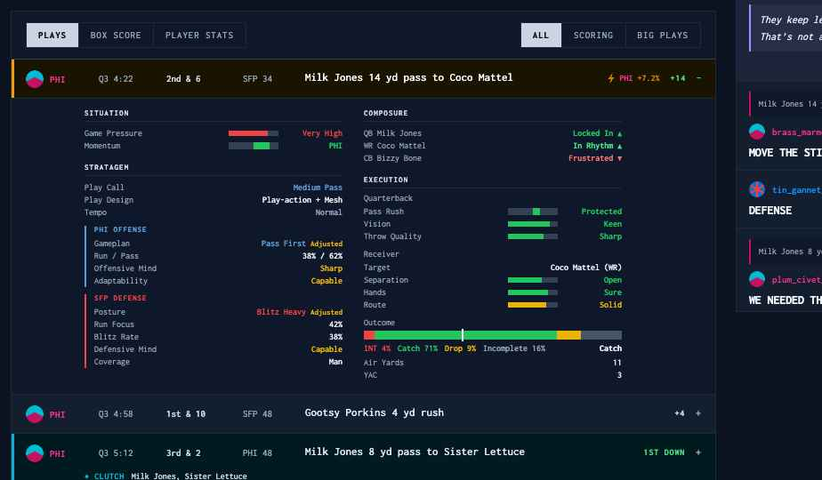
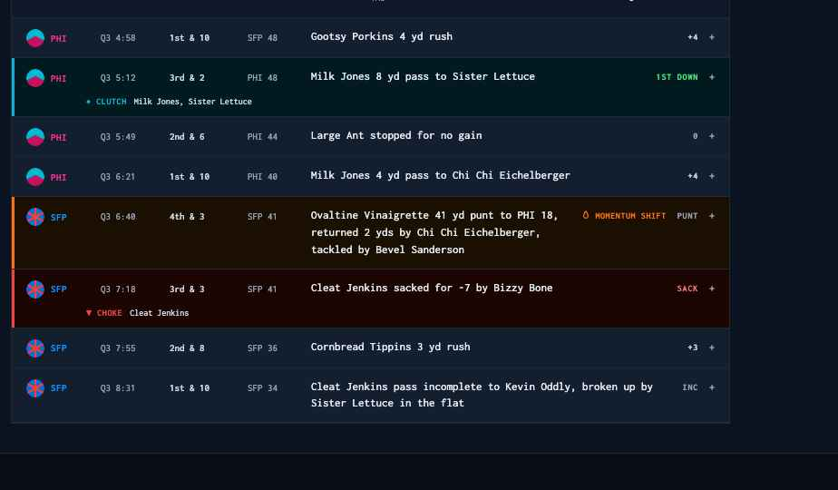
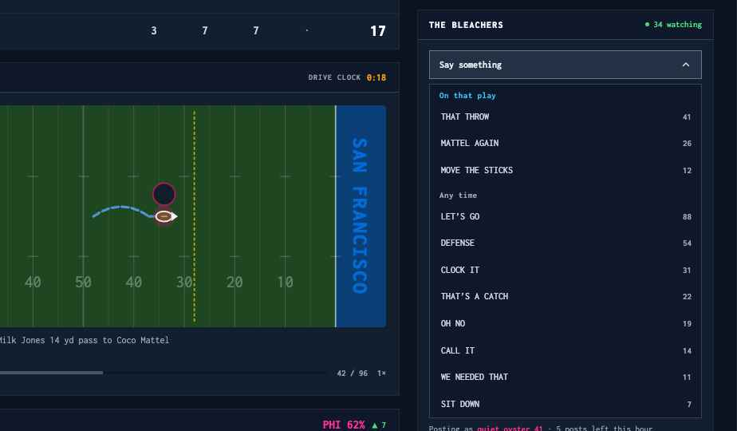
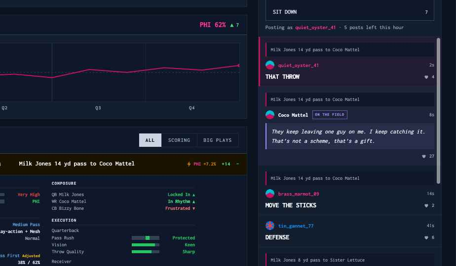
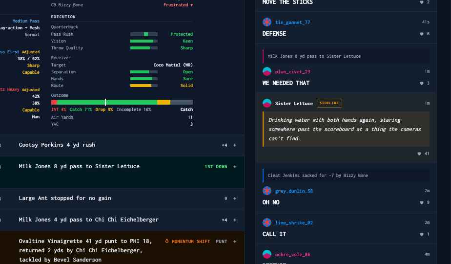

# Handoff: Game Page — modal → route (concept 1a)

## Overview

The live game currently lives in `GameModalNew` — a modal opened from the game board, the team
page and the front page. This redesign moves it onto its own **route**, and uses the space the
modal never had:

1. A **navigation bar** that returns to the game board and steps through the round's games in the
   board's own interest order.
2. A **scoreboard band** across the full width, tinted by both teams.
3. A **two-column body**: the game on the left (line score, field, win probability, replay, and the
   play-by-play with its expandable insights panel); **The Bleachers** — a live fan feed — in a
   372px right rail.
4. **One toggle** — Plays / Box Score / Player Stats — driving the lower panel, exactly as the
   modal's tab bar does today.

The organizing idea: nothing in the modal is lost, and the fan conversation finally has somewhere to
live. Play-by-play stays on the left so the game state is always in view; the right rail is the
social column, and it carries **three kinds of voice** — fans, players reacting to plays they were
part of, and sideline cutaways.

**Target:** a new route + view, reusing `GameModalNew.tsx`'s data layer and sub-components wholesale.
The modal itself can stay for the small-screen case (see *Responsive*), or be retired once the route
ships — that's a product call, not a design one.

## About the design files

`prototype/Game Page.dc.html` is a **design reference created in HTML** — a prototype showing
intended look and behavior. It is **not production code to copy**: one static file, hard-coded
fixture data, inline styles, no component structure worth lifting.

Your job: **recreate this design inside floosball-react** — React 18 + TypeScript, inline style
objects (house convention for newer components, per the repo's `CLAUDE.md`), real data from the
existing API/WS layer.

Open it by opening `prototype/Game Page.dc.html` in a browser (no server needed). Everything outside
the bordered 1440px screen — the "TURN 1" header and the `1a` label — is **prototype scaffolding, not
design**. Inside it, the Floosball header, the beta chip, the left icon rail and the sidebar are a
**mock of app chrome that already exists** (`Navbar`, sidebar). Do not rebuild them; they are context.

The `id="shot-field"` / `shot-plays` / `shot-bleachers` attributes exist only so the screenshots in
this folder could be captured. Ignore them.

## Fidelity

**High-fidelity.** Colors, type sizes, weights, spacing and interaction states below are final.

Two things are **ports, not new design** — match the source, not the prototype, if they ever
disagree:

- The **field graphic** is `GameModalNew.tsx`'s field SVG at its own geometry (600×220 viewBox,
  120-yard coordinate space, home end zone left). The prototype reproduces it statically; ship the
  real one.
- The **play insights panel** is `PlayInsightsPanel.tsx` unchanged. The prototype shows one
  representative pass play; the real panel is conditional on which insight blocks the sim emitted.

Team colors in the prototype (`#C51162` Broads / `#0071E3` Phones) are the API's `color` values and
must come from the team record. Text set in a team color uses the **corrected** variant
(`#fe2f97` / `#0c92ff` in the mock) — that is `utils/colors.ts`'s existing on-dark correction, the
same helper `GameModalNew` already uses for `awayDisplayColor`. Never set small text in the raw
brand color.

---

## Screens / Views

One view: the live game page. One new route — `/game/:gameId` (name it to match the app's existing
route conventions).

Page shell: the existing app chrome, then the game content. Body grid:
**`display: grid; grid-template-columns: minmax(0,1fr) 372px; gap: 22px; padding: 20px 28px 32px;
align-items: start`**. Both columns are `flex column; gap: 16px`.

**Panel** (used for every block in both columns): `background: #131e2f`, `border: 1px solid #1e293b`,
**radius 0**. Panel header: `padding: 12px 16px`, `background: #0f172a`,
`border-bottom: 1px solid #334155`, `display: flex; align-items: center; gap: 11px`. Header label:
`12px / 800 / letter-spacing 0.1em / #f1f5f9`, uppercase. A `flex: 1` spacer pushes the header's
right-hand controls out.

### 1. Navigation bar

`padding: 13px 28px`, `border-bottom: 1px solid #1e293b`, `background: #0b1220`,
`display: flex; align-items: center; gap: 14px`.

- **Back plate** — `background: #131e2f`, `border: 1px solid #334155`, `padding: 8px 13px`,
  `←` (`14px/800/#e2e8f0`) + `GAME BOARD` (`11px/700/0.08em/#e2e8f0`). Returns to the board.
- 1px × 24px `#1e293b` divider.
- **Prev / next plates** — same plate, `padding: 8px 11px`, chevron `13px/800/#94a3b8` on the outside
  and the adjacent game named (`11px/600/0.06em/#94a3b8`, e.g. `KCS at MIA`). Between them,
  `GAME 3 OF 16` (`11px/600/0.08em/#94a3b8`).
- Right side: `INTEREST ORDER` (`10px/600/0.12em/#94a3b8`) and, when the game involves the signed-in
  user's team, a `YOUR TEAM` chip — `10px/700/0.1em/#f472b6`, `border: 1px solid rgba(244,114,182,0.35)`,
  `padding: 5px 8px`.

**Order is the game board's own ranking** — reuse `Views/GameBoard/ranking.ts`, do not re-sort. Next
therefore means "the next most interesting game", which is the point. Wrap at both ends (disable
instead if that reads better with the board's semantics — but pick one and apply it to both).

### 2. Scoreboard band

`padding: 18px 28px`, `border-bottom: 1px solid #334155`, `display: flex; align-items: center;
gap: 26px`. Background:
`linear-gradient(100deg, {awayColor}1a 0%, #0b1220 42%, #0b1220 58%, {homeColor}22 100%)` — away
tint left, home tint right, matching the field's left/right convention.

Away block and home block are each `flex: 1; min-width: 0; display: flex; align-items: center;
gap: 14px`:

- Avatar `46×46`, `border-radius: 50%`. **The team in possession** gets
  `outline: 2px solid #ffffff; outline-offset: 3px` — the possession ring.
- City + record: `12px/500/0.04em/#94a3b8` and `11px/500/#94a3b8`. A **momentum flame** (Lucide
  flame, `13×13`, `#fb923c`) follows the record for the team currently holding momentum.
- Nickname: `24px/800/−0.025em/#f8fafc`, links to the team page, ellipsised.
- Score: `46px/800/#f8fafc`, tabular, `flex-shrink: 0`.

Center column (`flex-shrink: 0; flex column; align-items: center; gap: 9px; padding: 0 8px`):
`LIVE` with a pulsing `6px` dot (`11px/700/0.12em/#4ade80`; the dot animates
`opacity 1 → 0.25 → 1` over `1.6s ease-in-out`, infinite — respect `prefers-reduced-motion`), then
the clock `26px/800/#f8fafc` tabular, then down & distance + ball spot
(`10px/600/0.1em/#94a3b8`). For non-clock formats this center column carries whatever that format's
headline state is (see *Game formats*).

### 3. Line score

Panel. Header carries `STANDARD · THROUGH Q3` (`10px/600/0.1em/#94a3b8`) and a `FORMAT` badge
(`10px/700/0.06em/#38bdf8`, `border: 1px solid #1e3a52`, `padding: 3px 6px`) whose tooltip explains
how the table changes per format.

Rows: `display: grid; grid-template-columns: minmax(0,1fr) repeat(4, 54px) 62px; gap: 10px;
padding: 9px 16px (header) / 11px 16px (teams); border-bottom: 1px solid #1e293b`. Period headers
`10px/600/0.1em/#94a3b8` centered; period scores `15px/600/#cbd5e1` tabular centered; total
`20px/800/#f8fafc` tabular right.

### 4. The field

Panel. Header right: `DRIVE CLOCK` label + value (`12px/700/#f59e0b` tabular) when the drive-clock
rule is active; otherwise whatever pace rule is running, or nothing.

Body `padding: 16px`. **The SVG is a straight port of `GameModalNew.tsx`** — do not re-derive it:

- `viewBox="0 0 600 220"`, `width: 100%`, `border-radius: 4px`. `EZW = 600/12 = 50`.
- Coordinates are absolute yards-from-left, `0–120`: `toX(yfl) = yfl / 120 * 600`. **Home end zone
  is always LEFT**, away right — independent of who has the ball.
- End-zone rects in each team's color at `opacity 0.4`; playing field `#1e4620`.
- Goal lines at `toX(10)` / `toX(110)`, `rgba(255,255,255,0.55)`, `1.5`.
- 5-yard lines `[15,25,…105]` at `rgba(255,255,255,0.10)`, `0.6`; 10-yard lines `[10…110]` at
  `rgba(255,255,255,0.18)`, `0.75` (midfield `toX(60)` is `1.5`).
- Hash marks at every 10, `x ± 5` at `y = 0.32·FH` and `0.68·FH`, `rgba(255,255,255,0.2)`.
- Yard numbers at `y = 0.82·FH`, `font-size 17`, `rgba(255,255,255,0.3)`.
- End-zone team names, rotated `−90` (home) / `+90` (away), `font-size 21`, `800`,
  `letter-spacing 1.5`, team color at `opacity 0.9`. `(team.name || team.abbr).toUpperCase()`.
- Line to gain: `#FFD700`, `1.5`, `opacity 0.7`, `dasharray 3,2`.
- Last play: runs are a straight line; **passes arc through the air by `insights.pass.airYards`,
  then run straight for YAC** (`#60a5fa`, `2.5`, air leg `dasharray 7,3`); arrowhead at the end
  spot. Turnovers `#f87171`, touchdowns `#fbbf24`, FG arc `#4ade80`/`#ef4444`.
- Ball: `r 11` possession-color halo at `opacity 0.3`, `rx 8 / ry 5` `#7B4F2E` ellipse with a
  `rgba(255,255,255,0.9)` stroke and a lace line; above it a `r 11` `#0f172a` disc ringed in the
  possession color holding the team avatar; a white arrow points toward the attacking end zone.
- Sideline Goals hoops, big-play flashes and banners: keep as-is from the source.

Under the field: the play description, centered, `12px/1.4/#94a3b8`, plus the source's result badge
when `isFieldBadgeResult`. Then the **replay bar** — `REPLAY` label, three transport plates
(`border: 1px solid #334155`, `padding: 5px 9px`, active one `#e2e8f0` on `#475569`), a `4px`
scrub track (`#0f172a`, fill `#475569`), `42 / 96` position (`11px/600/#94a3b8` tabular) and a
speed control (`1×`).

### 5. Win probability

Panel. Header right: leading team + probability (`15px/800`, in that team's corrected color) and
the change since the last play (`11px/600`, `#4ade80` up / `#f87171` down, with `▲`/`▼`).

Chart `padding: 16px`: `viewBox="0 0 744 118"`, `preserveAspectRatio: none`, `background: #0f172a`,
`border: 1px solid #1e293b`. 50% line `#334155` dashed `3 4`; section dividers `#1e293b`, the
half-time divider at `2`; the line itself is the home team's raw color at `2`, `vector-effect:
non-scaling-stroke`, with a `r 3.5` dot on the live end. Section labels below,
`10px/600/0.1em/#94a3b8`, one flex cell each. **The axis is section-based** — reuse the source's
`wpAxis` (numSections / dividers / labels / bigDivider); it already handles every format.

### 6. Plays / Box Score / Player Stats

One panel, one header, **two control groups**:

- Left — the **view toggle**, a single segmented control: `background: #0f172a`,
  `border: 1px solid #1e293b`, segments `padding: 8px 13px`, `11px`, `letter-spacing: 0.08em`,
  divided by `border-left: 1px solid #1e293b`. Active segment: `800`, `#0b1220` on `#cbd5e1`.
  Inactive: `500`, `#94a3b8`, transparent. Labels `PLAYS` / `BOX SCORE` / `PLAYER STATS`.
  This replaces the modal's tab bar 1:1 (`activeTab: 'plays' | 'box' | 'stats'`).
- Right — the **plays filter**, an identical segmented control (`ALL` / `SCORING` / `BIG PLAYS`),
  shown **only** while the Plays view is active.

Box Score and Player Stats render the modal's existing `activeTab === 'box'` and `'stats'` content
inside this panel. Their layouts are unchanged and are not re-specified here.

#### 6a. Play rows

Row: `display: flex; align-items: flex-start; gap: 12px; padding: 11px 16px`, wrapper
`border-bottom: 1px solid #1e293b`.

`align-items: flex-start` is deliberate — **descriptions wrap**, and every other cell must stay on
the description's first line rather than floating to the row's vertical center. Fixed cells carry a
small `padding-top` to sit on that first line (`5px` for the 10–11px cells, `4px` for the 12px
expander, `1px` for the avatar cell) and `white-space: nowrap` so only the description wraps.

| Cell | Width | Style |
| --- | --- | --- |
| Team | 70px | avatar `20×20` round + abbr `11px/700/0.04em` in the team's corrected color |
| Clock | 64px | `11px/500/#94a3b8`, tabular |
| Down & distance | 74px | `11px/600/#cbd5e1`, tabular |
| Ball spot | 58px | `11px/500/#94a3b8` |
| Description | `flex: 1; min-width: 0` | `13px/500/1.45`, `text-wrap: pretty`; `#f8fafc` on accented rows, `#e2e8f0` otherwise |
| Result badge | auto | `10px/700/0.08em`, colored by `getResultColor` |
| Expander | auto | `+` / `−`, `#94a3b8` collapsed, `#38bdf8` expanded — only on plays with insights |

#### 6b. Play highlighting

**Carried over from the modal unchanged** — same flags, same colors. Accent is
`box-shadow: inset 3px 0 0 {color}` plus a tinted row background:

| Kind | Accent | Background | Marker |
| --- | --- | --- | --- |
| Big play | `#f59e0b` | `#1a1300` | bolt + `{ABBR} +{wpa}%` in `#d97706`, team abbr in the team color |
| Clutch | `#06b6d4` | `#001a1f` | second line: `◆ CLUTCH` + `clutchPerformers` |
| Choke | `#ef4444` | `#1a0500` | second line: `▼ CHOKE` + `chokePerformers` |
| Momentum shift | `#f97316` | `#1a0f00` | flame glyph + `MOMENTUM SHIFT`, `10px/700/0.06em` |

Precedence for the accent is big → clutch → choke → momentum (the source's order). The
`MOMENTUM SHIFT` marker only renders when none of the other three apply. The attribution line sits
under the row at `padding: 0 16px 11px 82px` — flush with the description column — label `10px/700`
in the accent color, names `10px/500/#cbd5e1`.

Anomaly (`glitchText`) and awakened-power rows keep their existing classes and treatment.

#### 6c. Play insights panel

Clicking a play with insights expands it. `padding: 12px 16px 14px 82px` (aligned to the description
column), `background: #0f172a`, `border-top: 1px solid #1e293b`.

**This is `PlayInsightsPanel.tsx`.** Two columns, `gap: 24px`, each `flex: 1; max-width: 290px`,
`gap: 13px` between sections. Left column: Situation, Stratagem, Fourth Down, Clock Management.
Right column: Composure, then Execution (Run / Pass / FG, whichever fired).

Section label: `9px/700/0.12em/#cbd5e1`, `padding-bottom: 4px`, `border-bottom: 1px solid #1e293b`.
Row: `flex; justify-content: space-between; padding: 2px 0`; label `10px/400/#94a3b8`, value
`10px/600/#e2e8f0` (tabular where numeric). Gauges: a `56×6` `#334155` track with a colored fill,
plus a `66px` right-aligned word in the same color. Differential bars (momentum, pass rush, line
matchup) are `56×8`, filled from the center — green right, red left. The outcome bar is the
source's stacked INT / Catch / Drop / Incomplete zones with the white roll marker at `outcomeRoll`
and the engine's resolved outcome named at the right.

Thresholds and color ramps (`qualityColor`, `attrColor`, `mentalStateDescriptor`, the coach and
posture descriptors) all live in `PlayInsightsPanel.tsx` already. **Do not re-derive them.**

### 7. Right rail — Rally, then The Bleachers

**Rally** sits at the top of the rail, above the feed: panel with `padding: 14px`, header row
`RALLY` + cost (`10px/400/#94a3b8`, "40 floobits, +1 confidence"), then two team plates side by side
(`flex: 1`, `padding: 11px 0`, avatar `20×20` + abbr `11px/700/0.06em`), each tinted with its own
team color at `1f` background and `66` border. Existing rally behavior and costs; this is a
restyle, not a new mechanic.

**The Bleachers** is the rail's main panel. Header: `THE BLEACHERS` + a live watching count —
pulsing `5px` dot and `11px/600/#4ade80`, e.g. `34 watching`. The count is the empty state too: a
game nobody has posted in still shows how many people are here.

**Composer** — this is `Sentiment/TeamFeed.tsx`'s `composer="dropdown"`, reused:
`padding: 13px 14px`, `border-bottom: 1px solid #1e293b`.

- Trigger: full width, `padding: 10px 12px`, `12px/700`. Closed — `border: 1px solid #334155`,
  `background: #0f172a`. Open — `border: 1px solid #64748b`, `background: #243044`. Label
  `Say something` signed in, `Sign in to join in` signed out. Chevron `14×14`, rotates `180°` on
  open, `160ms ease`.
- Panel: `margin-top: 6px`, `border: 1px solid #334155`, `background: #0f172a`.
- Group headings `11px/700/0.04em`, `padding: 8px 12px 5px`. **On that play** in `#38bdf8` —
  lines that reference what just happened, so they only exist while that play is the live one.
  **Any time** in `#94a3b8` — the always-available set.
- Options: `flex; align-items: baseline; gap: 8px; padding: 9px 12px`,
  `border-left: 2px solid transparent`. Text `12px/500/#cbd5e1`; count `11px/700/#94a3b8` tabular,
  right. Hover: `background: #152033`, `border-left-color: #38bdf8`.
- Below: `Posting as {handle} · N posts left this hour`, `11px/400/#94a3b8`, handle in the user's
  team color at `700`.

Option labels are **all caps and must match the feed exactly** — the string you pick is the string
that gets posted.

**Feed** — `max-height: 520px; overflow-y: auto`. Three entry kinds share one row shell
(`flex column; gap: 8px; padding: 12px 14px; border-bottom: 1px solid #1e293b`):

1. **Fan post.** Optional **play quote** first — `padding: 7px 9px`, `background: #0f172a`,
   `border-left: 2px solid {posting team color}`, text `10px/400/1.4/#94a3b8`. This is how a
   right-column post stays legible about a left-column play; posts with no play attached omit it.
   Then the byline (avatar `18×18`, handle `11px/600` in the team's corrected color, `flex` spacer,
   relative time `10px/400/#94a3b8`), then the shout — `14px/700/#f1f5f9`, `letter-spacing: −0.01em`
   — and a heart + count (`10px/600/#94a3b8`) on the right. **The user's own post** takes
   `background: rgba({teamColor}, 0.08)` and `box-shadow: inset 3px 0 0 {teamColor}`.
2. **Player reaction.** A `PersonalityEvent` fired on a play the player was part of. Same play
   quote; byline is the player's name (`11px/700/#f1f5f9`) plus an `ON THE FIELD` tag
   (`8px/700/0.12em`, `padding: 4px 5px`, `border: 1px solid` at 60% of the accent). The line itself
   is italic `12px/1.55/#e2e8f0` in a `border-left: 2px solid {accent}` block on `{accent}` at ~9%.
   Row background `{accent}` at 5%. Reactions and counts work the same as on a fan post.
3. **Sideline cutaway.** A `SidelineCutaway` — no play quote (it fires between plays), tag reads
   `SIDELINE`, otherwise identical to the player reaction.

**Accent is the personality tier**, from `utils/personality.ts`'s `personalityAccent`:
base vibe `#38bdf8`, common variant `#a78bfa`, rare variant `#f59e0b`. A Stoic line reads as
background flavour; a Prophet line is meant to stand out.

Player reactions and cutaways were previously inline in the play feed. **They move here.** The
play-by-play column no longer renders `personalityEvent` lines or `isSidelineCutaway` rows.

---

## Interactions & Behavior

- **Game switching.** Prev/next re-route to the adjacent game in interest order. Preserve the
  active view tab across the switch; reset replay and the expanded play.
- **Expanding a play.** One play open at a time (`expandedPlayKey`, as today). Only plays with
  insights are clickable — the rest keep `cursor: default` and show no expander.
- **Posting.** Picking an option posts immediately and optimistically prepends the post; the
  composer closes. The mount guard in `PlayReactions.tsx` (600ms) exists because a tap that opened
  the modal could ghost-click a reaction — a route has no open gesture, but keep the guard for the
  composer-open tap.
- **Play-specific options** are derived from the live play and disappear when the next play lands.
  A post already in the feed keeps its quote regardless.
- **Reactions** on posts, player reactions and cutaways all use the existing
  `POST /games/:id/reactions` path with `targetType` `play` / `sideline_quote`.
- **Live updates.** Everything on the page is driven by the existing WS game feed — scoreboard,
  possession ring, momentum flame, field, WP chart, play list, feed. New plays enter the play list
  at the top; new posts enter the feed at the top. Don't animate the whole list on every tick.
- **Replay.** Same behavior as the modal: entering replay forces the Plays view and drives the
  field, WP chart and play list from the cursor.
- **Hover.** Play rows `background: rgba(255,255,255,0.04)`; plates take `border-color: #475569`,
  `background: #1b2739`; composer options as specced. Everything interactive needs a visible hover.
- **Focus.** Keyboard focus ring on every control: `outline: 2px solid #38bdf8; outline-offset: 2px`.
- **Responsive.** Designed at 1440px. Below ~1180px the rail drops under the left column at full
  width, and the feed's `max-height` is released. Below ~760px the scoreboard band stacks
  (teams over the clock block) and play rows reflow to two lines: meta on line one, description on
  line two. This is also the point at which keeping the existing modal may be cheaper than
  responding the route — decide before building.
- **Signed out.** The composer trigger reads `Sign in to join in` and opens the Clerk flow; the feed
  and everything else render normally. Rally plates are inert with the same treatment.

## Game formats

The mock is a **standard four-quarter game**. The source is already format-aware and the page must
inherit that, not re-implement it:

| Format | What changes |
| --- | --- |
| Innings | Line score columns become innings; play rows show `TOP/BOT n · Try k/N`; the clock block shows at-bat context |
| Frames | Line score by frame; rows show `Frame n` + frame clock; frames-won is the headline |
| Play limit | Clock replaced by plays remaining |
| Chess clock | Per-team budgets; a budget hitting zero posts a red-accented timeout event |
| Drive clock | The field header's `DRIVE CLOCK` value |
| Sideline Goals | Hoop pairs render on the field |

The WP axis, line score and clock all read from the same section model — `wpAxis` and the format
helpers in `Views/GameBoard/gameFormat.tsx`.

## State Management

Nothing new. Lift what `GameModalNew` already owns into the view:

- `gameData` from `GamesContext` + the `/ws/game/:id` feed.
- `activeTab`, `expandedPlayKey`, replay state (`replayIndex`, `replayActive`, `replayPlaying`,
  `replaySpeed`).
- Reaction aggregates via `updateGameReactions` in `GamesContext`.
- Auth from `useAuth()` (Clerk).

New:

- Route param `gameId`.
- `adjacentGames` — previous/next from the board's ranked list. Derive with
  `Views/GameBoard/ranking.ts` against the round's games; memoise.
- Feed composition — fan posts, `personalityEvent`s and `sidelineCutaway`s merged into one
  reverse-chronological list. Build it in a selector, not in render.

## Data

Types exist — **point at them, don't invent new ones**:

- `src/types/websocket.ts` — `PlayInsights` and every `PlayInsights*` sub-interface,
  `PersonalityEvent`, `SidelineCutaway`, `SidelineGoalsState`, `TeamGameStats`.
- `src/Components/GameModal/PlayReactions.tsx` — `ReactionType`, `ReactionTargetType`,
  `ReactionBucket`, `ReactionAggregate`.
- `src/types/api.ts` — `Team`, `Player`.

One genuinely new need: **the fan feed's canned lines, split into play-specific and always-available
sets.** Today `TeamFeed` cheers are valence-grouped (support / frustration) against a team. The game
page needs a per-play group whose availability is tied to the live play. Confirm with the backend
whether that's a new endpoint or a client-side derivation from the play; degrade to the always-
available set alone if the play-specific set isn't there.

Every name, number, handle and line in the prototype is a **fixture** — Broads vs Phones, season 16,
week 15, Q3. Do not port them.

## Design Tokens

| Token | Value | Use |
| --- | --- | --- |
| Page background | `#0b1220` | page, nav bar, scoreboard base |
| Surface | `#131e2f` | every panel, plates |
| Surface raised (hover) | `#1b2739` / `#243044` | plate hover / composer open |
| Chrome | `#0f172a` | panel headers, insights panel, play quotes, bar tracks |
| Border | `#1e293b` | panel borders, row rules |
| Border strong | `#334155` | header underline, plate borders, gauge tracks |
| Border hover | `#475569` / `#64748b` | plate hover, composer open border |
| Text primary | `#f8fafc` / `#f1f5f9` | scores, names, shouts, panel labels |
| Text body | `#e2e8f0` / `#cbd5e1` | descriptions, values |
| Text secondary | `#94a3b8` | labels, metadata — **the floor for readable text** |
| Field turf | `#1e4620` | field graphic only |
| Ball | `#7B4F2E` | field graphic only |

Semantic:

| Token | Value | Use |
| --- | --- | --- |
| Live / good | `#4ade80` (bars `#22c55e`) | LIVE dot, watching count, positive gauges, 1st downs |
| Bad | `#f87171` (bars `#ef4444`) | sacks, negative gauges, choke |
| Mid | `#eab308` / `#f59e0b` | mid gauges, drive clock, big plays, rare personality |
| Big-play marker | `#d97706` | the bolt + WPA swing |
| Clutch | `#06b6d4` | clutch accent + attribution |
| Momentum | `#f97316` | momentum-shift accent + flame |
| Info | `#38bdf8` | expander, format badge, play-specific group, base personality |
| Pass trajectory | `#60a5fa` | field air arc + YAC |
| Line to gain | `#FFD700` | field marker |
| Variant personality | `#a78bfa` | common-variant reactions |
| Your team | `#f472b6` | the nav chip |
| Team colors | `team.color` | end zones, scoreboard gradient, rally plates, quote rules |
| Team text | corrected via `utils/colors.ts` | abbrs, handles, WP figure |

Type — one family, `font-pixel` (`pressStart` / Inconsolata, already global):

| Role | Size / line-height / weight / tracking |
| --- | --- |
| Score | 46 / 1 / 800 (tabular) |
| Clock | 26 / 1 / 800 (tabular) |
| Team nickname | 24 / 1 / 800 / −0.025em |
| Line-score total | 20 / 1 / 800 (tabular) |
| Field yard numbers | 17 (SVG) |
| WP headline | 15 / 1 / 800 (tabular) |
| Feed shout | 14 / 1 / 700 / −0.01em |
| Play description | 13 / 1.45 / 500 |
| Panel label | 12 / 1 / 800 / 0.1em |
| Feed body (italic lines) | 12 / 1.55 / 400 |
| Row meta, badges | 11 / 1 / 500–700 / 0.04–0.08em |
| Insights row | 10 / 1 / 400 label, 600 value |
| Micro label, tag | 8–10 / 1 / 600–800 / 0.1–0.14em |

Spacing: `2, 4, 5, 6, 8, 9, 10, 11, 12, 13, 14, 16, 18, 22, 24, 26, 28, 32` px. Fixed widths:
right rail `372`; play-row cells `70 / 64 / 74 / 58`; insights column `290`, gauge track `56`, gauge
word `66`. **Radius 0 everywhere** except the field SVG (`4px`) and avatars (`50%`). No shadows —
depth is the `#131e2f` / `#0b1220` surface step plus borders, and the one `inset` accent rule.

## Conformance notes

1. `#64748b` and `#475569` are below the repo's readable-text floor (`CLAUDE.md`). They appear in
   this spec **only** as borders and bar tracks. Every readable string bottoms out at `#94a3b8`.
2. Team brand colors are never used for small text — always the `utils/colors.ts` correction. The
   prototype's `#fe2f97` / `#0c92ff` are that correction applied to `#C51162` / `#0071E3`.
3. No emoji. The bolt, flame, chevrons, hearts and clutch/choke glyphs are inline SVG or the
   existing icon set.

## Files

- `prototype/Game Page.dc.html` — the design. Ship the view labeled **`1a`**.
- `prototype/assets/`, `prototype/support.js` — what the prototype needs to open.
- `screenshots/01-page-top.png` — chrome, nav bar, scoreboard, line score.
- `screenshots/02-field.png` — the field graphic and replay bar.
- `screenshots/03-play-insights.png` — the view toggle and an expanded play.
- `screenshots/04-play-highlights.png` — clutch, momentum-shift and choke rows, and wrapped descriptions.
- `screenshots/05-bleachers-composer.png` — the dropdown composer, open.
- `screenshots/06-feed-player-reaction.png` — fan posts with play quotes, and a player reaction.
- `screenshots/07-feed-sideline-cutaway.png` — a sideline cutaway in the feed.

In the target repo:

- `src/Components/GameModalNew.tsx` — **the source of everything.** Lift its data layer, field SVG,
  WP chart, play rendering, replay and tab content into the new view.
- `src/Components/PlayInsightsPanel.tsx` — reuse **unchanged**.
- `src/Components/GameModal/PlayReactions.tsx` — reuse; restyle to the feed row.
- `src/Components/Sentiment/TeamFeed.tsx` — the composer and feed shell; extend for the two player
  entry kinds rather than forking.
- `src/utils/personality.ts` — `personalityAccent` / `personalityTier` drive the entry accents.
- `src/utils/colors.ts` — on-dark team-color correction.
- `src/Views/GameBoard/ranking.ts` — interest order for prev/next.
- `src/Views/GameBoard/gameFormat.tsx` — format-aware line score, clock and axis.
- `src/contexts/GamesContext.tsx` — game cache, reaction aggregates, cutaway injection.
- `CLAUDE.md` — house conventions. Update it if this page changes anything documented there.
