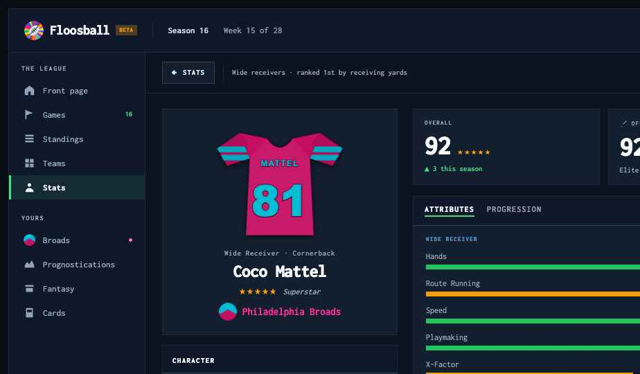
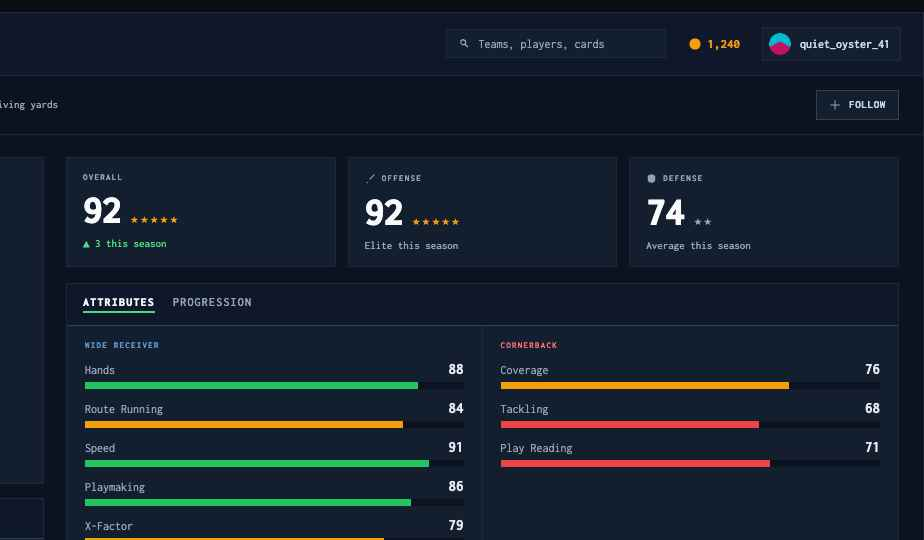
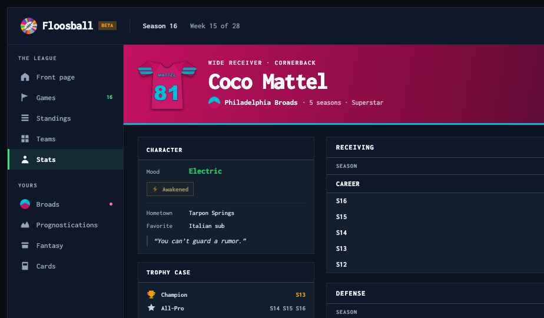
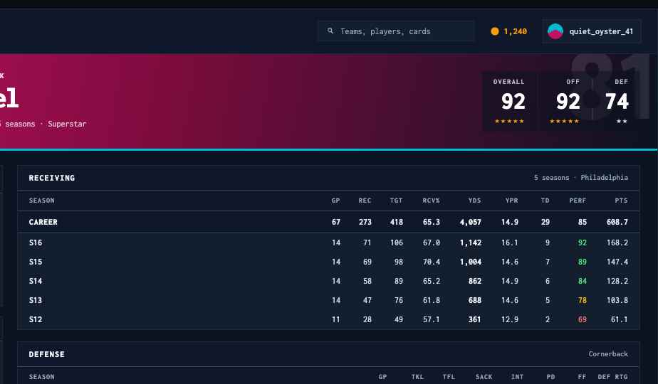
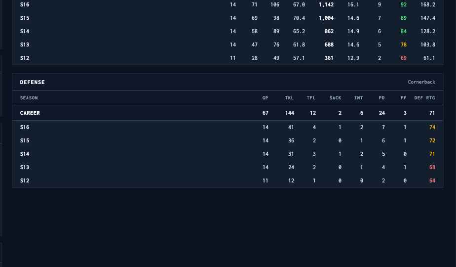

# Handoff: Player profile page — identity rail, then the numbers

## Overview

`PlayerPage.tsx` today is a three-column hero — jersey stack, a tabbed Attributes/Progression/Awards
panel, and a moments+trophies column — sitting over a career table. Three columns compete at the
same visual weight, attributes hide inside a tab, and the stats start well below the fold. This
reorganises the same material into **two columns**: a fixed identity rail on the left, one content
column on the right.

The reading order is deliberate: **who he is → how good he is → the numbers.**

Two directions are provided. They differ only in the hero, in how the career numbers are presented,
and in density — everything else is shared.

**Deliberately cut** (all currently rendered, all removed here):

- **Mental profile panel** — composure, focus, instinct, creativity, discipline, pressure handling.
- **Fatigue and demeanor drift** — the condition readout.
- **Personality archetype and quirk chips.**
- **Fan rating** — that belongs on the team page.
- **Comparative context** — no percentiles, no rank badges, no league-average markers.
- **Game log** — not added.

**Kept:** jersey and team, overall with the offense/defense split, attribute bars, trophy case,
recent moments, rating progression, mood, awakened status, and the flavour fields.

**Target:** rewrite `src/Views/Players/PlayerPage.tsx` in place. Its three fetches are unchanged —
the data contract needs two small additions, listed under **Data**.

## About the design files

`prototype/Player Profile.dc.html` is a **design reference created in HTML** — intended look and
behaviour, not production code. One static file, fixture data, inline styles.

Open it in a browser (no server needed). It shows one turn with two options, `1a` and `1b`, side by
side. Pick one; they are not meant to be merged.

The Floosball header and the 196px left sidebar are a **mock of app chrome that already exists**
(`Navbar`, sidebar). Do not rebuild them.

The fixture player is **Coco Mattel**, WR/CB, Philadelphia Broads, #81 — a real shape from the sim,
including the both-ways position pair (WR→CB per `DEF_POSITION_FULL`).

## Fidelity

**High-fidelity.** Colours, type sizes, weights and spacing below are final.

Three things are **not** design decisions — they are existing sim logic and must stay in sync:

| Ramp | Thresholds | Source | Applies to |
| --- | --- | --- | --- |
| Attribute bar | `≥85 → #22c55e`, `≥72 → #f59e0b`, else `#ef4444` | `PlayerPage.tsx` `attrRow` | attribute bar fills |
| `attrColor` | `≥80 → #4ade80`, `≥70 → #eab308`, else `#f87171` | `PlayInsightsPanel.tsx` | PERF and DEF RTG columns |
| Quirk tier | `QUIRK_TIER_COLORS` | existing | n/a here — quirk chips are cut |

The **jersey is a verbatim port** of `PlayerJersey` from `PlayerPage.tsx` — same 200×185 viewBox,
same angled sleeve paths, secondary-colour sleeve stripes, body highlight, collar arc, nameplate and
number. Reuse the component; do not redraw it. It appears at 182px in `1a`'s rail and 100px in
`1b`'s banner.

---

## Screens / Views

Page shell: existing app chrome, then the content area. Both options use
`display: grid` with a fixed rail and a fluid content column, `align-items: start`.

### 1a — Standing




`grid-template-columns: 340px minmax(0,1fr); gap: 22px; padding: 22px 24px 32px`.

**Context bar** above the grid — `padding: 13px 24px; border-bottom: 1px solid #1e293b`: a back
plate to Stats (`← STATS`), a rule, the player's standing in one line
(`Wide receivers · ranked 1st by receiving yards`), spacer, a `FOLLOW` plate. This is the only place
the profile mentions rank; it is a navigational breadcrumb, not comparative context.

**Rail, in order:**

1. **Identity panel** — `background: #131e2f; border: 1px solid #1e293b; padding: 20px`, centred
   column: jersey at 182px, then position line (`Wide Receiver · Cornerback`, `11px/500/#94a3b8`),
   name (`26px/800/−0.03em/#f8fafc`), star row + rank label (`Superstar`, italic), and the team as an
   avatar+name link in the **team's primary colour**.
2. **Character panel** — mood (label + `15px/800` in the mood tier colour), the awakened badge, a
   rule, then hometown and favourite as label/value rows, then the motto as an italic quote with a
   `2px #334155` left rule.
3. **Trophy case** — three columns across the rail: championship, all-pro, records, each an icon,
   a caption and the seasons. A records note runs underneath.
4. **Recent moments** — up to three quotes, each on a tinted card with a 2px left rule; purple
   `#a78bfa` for milestone quotes, blue `#38bdf8` for game quotes.

**Content column, in order:**

1. **Ratings band** — three equal plates: `OVERALL`, `OFFENSE`, `DEFENSE`. Each is a 9px tracked
   label, a `40px/800` tabular number with the star row beside it, and one line of context (season
   delta on overall, the season-impact tier on the other two).
2. **Attributes / Progression panel** — the header is a **tab row**: active tab `800 #f1f5f9` with a
   `2px #4ade80` bottom border, inactive `600 #94a3b8`. Attributes is the default: two columns split
   by side, `WIDE RECEIVER` in `#5b9bd5` and `CORNERBACK` in `#f87171`, each attribute a label, a
   `15px/700` value and a 7px bar. Progression shows the rating chart.
3. **Career stats** — one table with a `RECEIVING / DEFENSE` segmented control in its header. The
   **career totals row sits directly under the column header**, then seasons newest-first.

### 1b — Banner





`grid-template-columns: 300px minmax(0,1fr); gap: 20px; padding: 20px 24px 32px`.

**Hero banner** replaces both the context bar and the identity panel:
`linear-gradient(100deg, {teamColor} 0%, {teamColorDark} 44%, #0b1220 100%)` with a
`3px solid {teamSecondary}` bottom border, `padding: 20px 24px`. Contents: the jersey number as a
`150px` ghost numeral at `rgba(255,255,255,0.10)` bleeding off the right edge, the jersey at 100px,
then the position line, the name at `40px/800`, and the team link — all in white. On the right, three
translucent plates (`rgba(11,18,32,0.55)`) carry `OVERALL`, `OFF`, `DEF` with `34px/800` numbers and
star rows.

**Rail:** character panel, trophy case (compact single-column list), recent moments, then the
attributes/progression panel — same tab pattern, bars laid out as label / bar / value in one row so
they fit 300px.

**Content column:** the `RECEIVING` and `DEFENSE` tables are **both shown, stacked** rather than
behind a toggle — the trade for the compact rail. Each has its career totals row directly under the
header.

The banner is the identity, so the rail leads with character. This option puts more numbers on the
first screen; `1a` puts more identity there.

---

## Interactions & Behavior

- **Attributes / Progression tabs.** Local state, no route change. Progression renders the
  `rating-history` line — one point per season, the current season emphasised, season labels and
  values beneath.
- **Career table toggle (1a).** `RECEIVING / DEFENSE`. Show the defense segment only when the player
  has defensive stats. For a QB the offensive segment is `PASSING`; for a K, `KICKING`.
- **Awakened is conditional.** When the player has not awakened, the row is **absent entirely** —
  no label, no placeholder, no "not awakened" state. When present it is a single badge reading
  `Awakened` with a bolt glyph, on a `rgba(245,158,11,0.07)` field with a `rgba(251,191,36,0.45)`
  border, gently pulsing. It does **not** show the power name or the charge state — that detail
  belongs in game context, not on the profile.
- **Prospects.** No team link; show the drafting team instead. No career table — show the attribute
  panel and a line stating the draft class.
- **Retired players.** Banner/identity panel unchanged; mood and awakened rows are absent; the
  career table is the whole content column.
- **Hover.** Table rows `rgba(255,255,255,0.04)`; plates take `border-color: #475569` and
  `background: #1b2739`.
- **Focus.** `outline: 2px solid #38bdf8; outline-offset: 2px` on tabs, toggles and plates.
- **Empty states.** No trophies → hide the panel. No quotes → hide the panel. Never render an empty
  shell. A player with one season still shows the progression tab with a single point.
- **Responsive.** Designed at 1440px. Below ~1100px the rail drops under the content column
  (identity first, then content, then the rest of the rail). Below ~760px the ratings band stacks and
  the career tables scroll horizontally with the season cell pinned.

## State Management

Page-local:

```ts
attrTab:   'attributes' | 'progression'
statsSide: 'offense' | 'defense'     // 1a only; 1b shows both
```

Everything else is server state from the three existing fetches. No new context.

---

## Data

The three existing calls stay as they are:

| Endpoint | Returns |
| --- | --- |
| `GET /api/players/:id` | `PlayerData` — identity, ratings, attributes, `stats[]`, `allTimeStats` |
| `GET /api/players/:id/rating-history` | per-season rating points, for the progression tab |
| `GET /api/players/:id/quotes` | the recent-moments quotes |

### What the page already gets

`PlayerData` (from `PlayerPage.tsx`) covers nearly everything: `name`, `number`, `position`,
`defensivePosition`, `teamColor`, `teamSecondaryColor`, `teamAbbr`, `seasonsPlayed`, `playerRating`,
`ratingStars`, `offensiveRating` / `offensiveRatingStars`, `defensiveRating` /
`defensiveRatingStars`, `rank`, `championships`, `allProSeasons`, `recordsHeld`, `seasonImpact`,
`attributes`, `stats[]`, `allTimeStats`.

`PlayerAttributes` carries `att1…att3` (+ values and stars), `playmakingValue`, `xFactorValue`,
`defensiveAttributes` (a keyed record of `{value, stars}`), `mood`, `moodTier`, `hometown`,
`favorite_category`, `favorite_item`, `motto`.

The fields the page **stops** using: `attitude`, `resilience`, `selfBelief`, `pressureHandling`,
`discipline`, `focus`, `instinct`, `creativity`, `demeanor`, `demeanorDrift`, `fatigue`,
`personality`. Leave them on the type — other surfaces use them — just stop rendering them here.

### What needs to be added

Only two things, both small.

#### A. Awakened status

```ts
interface PlayerAttributes {
  // …existing…
  isAwakened?: boolean    // NEW — has this player awakened at all
}
```

The design needs **only the boolean**. The sim tracks awakened powers with names and charge states;
the profile deliberately shows neither. If a boolean isn't cheap to add, deriving it from the
existing awakened-power field is fine — but the render must be all-or-nothing, and a non-awakened
player must produce no markup at all.

#### B. Season-by-season defensive stats

`stats[]` today is typed `any[]` and carries the offensive line per season. The `1b` defense table —
and `1a`'s defense segment — need the defensive line per season, in the same row shape:

```ts
interface PlayerSeasonRow {
  season: number
  teamAbbr: string | null
  gamesPlayed: number

  // ── existing per-season offensive shapes ──
  passing?:   { comp, att, compPerc, yards, tds, ints, ypc }
  rushing?:   { carries, yards, ypc, tds, fumblesLost }
  receiving?: { receptions, targets, rcvPerc, yards, ypr, tds }
  kicking?:   { fgs, fgAtt, fgPerc }

  // ── NEW: per-season defensive aggregate ──
  defense?: {
    tackles: number
    tfl: number
    sacks: number
    ints: number
    passesDefended: number    // = passBreakups
    forcedFumbles: number
    fumbleRecoveries: number
    defensiveTds: number
    rating: number            // 0-100, drives the DEF RTG column
  }

  // ── NEW: impact, one field ──
  performanceRating?: number  // 0-100, drives the PERF column
}
```

Two notes for whoever builds it:

- **This is the same aggregation the stats page needs.** `PlayerBase.defense` in `types/websocket.ts`
  already carries `{ sacks, ints, tackles, tfl, forcedFumbles, passBreakups }` per game; nothing sums
  it to a season. Build the season accumulator once and both pages are served —
  `StatsPlayerRow.defense` in the stats-page handoff is the same shape.
- **`performanceRating` is already computed** — it's a category on `GET /api/stats/leaders`
  (`performance_rating`). It just isn't exposed on the per-player season row.

`allTimeStats` needs the matching career totals for whichever segments are shown, including
`defense` and a career `performanceRating`. The career row is rendered **above** the seasons, so it
must arrive with the same fields or the column widths won't line up.

---

## Design Tokens

| Token | Value | Use |
| --- | --- | --- |
| Page background | `#0b1220` | content area, bar interiors |
| Panel | `#131e2f` | every rail and content panel |
| Chrome | `#0f172a` | panel headers, table headers, career totals row |
| Border | `#1e293b` | panel borders, internal rules |
| Border faint | `#16202f` | table row rules |
| Border strong | `#334155` | panel header underline, quote rules |
| Border hover | `#475569` | plate hover |
| Text primary | `#f8fafc` / `#f1f5f9` | name, panel titles, sorted values |
| Text body | `#cbd5e1` | stat cells, flavour values, quotes |
| Text secondary | `#94a3b8` | labels, column headers, inactive tabs — **the floor for readable text** |
| Active tab | `#4ade80` underline | attributes/progression tabs, nav active state |
| Attribute bars | `#22c55e` / `#f59e0b` / `#ef4444` | the `attrRow` ramp |
| Stat ramp | `#4ade80` / `#eab308` / `#f87171` | PERF, DEF RTG |
| Awakened | text `#fde68a`, fill `rgba(245,158,11,0.07)`, border `rgba(251,191,36,0.45)` | the badge |
| Quote — milestone | `#a78bfa`, fill `rgba(167,139,250,0.09)` | recent moments |
| Quote — game | `#38bdf8`, fill `rgba(56,189,248,0.09)` | recent moments |
| Trophy gold / silver / purple | `#f59e0b` / `#cbd5e1` / `#a78bfa` | championship / all-pro / record |

Type — one family, `font-pixel` (`pressStart` / Inconsolata, already global):

| Role | Size / line-height / weight / tracking |
| --- | --- |
| Name — 1a | 26 / 1.1 / 800 / −0.03em |
| Name — 1b banner | 40 / 1 / 800 / −0.04em |
| Rating number | 40 / 1 / 800 tabular (34 in the 1b banner) |
| Panel title | 11–12 / 1 / 800 / 0.1–0.12em |
| Attribute value | 15 / 1 / 700 tabular |
| Stat cell | 12 / 1 / 500 tabular; career totals row 700–800 |
| Season cell | 12 / 1 / 700 tabular |
| Column header | 10 / 1 / 700 / 0.1em |
| Field label | 11 / 1 / 400 |
| Group label (`WIDE RECEIVER`) | 9 / 1 / 700 / 0.14em |
| Quote | 12 / 1.5 / 400 italic |

Spacing: `4, 5, 7, 8, 10, 11, 13, 14, 16, 20, 22` px. Bars are 7px tall in 1a, 6px in 1b.
**Radius 0 everywhere** except avatars (`50%`). No shadows — the jersey carries the only drop shadow,
and it comes with the ported component.

## Conformance notes

1. Every readable string bottoms out at `#94a3b8`; `#475569` and below appear only as borders.
2. Team colour is used for the team link, the banner gradient and the progression line — never for
   small text on a dark field.
3. No emoji. Trophies, the bolt, chevrons and the back arrow are inline SVG.
4. The career totals row above the seasons is intentional and applies to every table on the page —
   the same convention should reach the stats page if it ever grows a totals row.

## Files

- `prototype/Player Profile.dc.html` — the design, `1a` and `1b`.
- `prototype/assets/`, `prototype/support.js` — what the prototype needs to open.
- `screenshots/01-1a-left.png`, `02-1a-right.png`, `03-1a-right-scrolled.png` — option 1a.
- `screenshots/04-1b-left.png`, `05-1b-right.png`, `06-1b-right-scrolled.png` — option 1b.

In the target repo:

- `src/Views/Players/PlayerPage.tsx` — **rewrite in place**; keep `PlayerJersey` and the three
  fetches, replace the layout.
- `src/Components/PlayInsightsPanel.tsx` — lift `attrColor` into a shared helper; the profile, the
  stats page and the insights panel must use one function.
- `src/Components/Stars.tsx` — `STAR_COLORS` and the star row, unchanged.
- `src/utils/mentalProfile.ts` — **no longer imported by this page** (the mental panel is cut).
  Check whether anything else uses it before deleting.
- `src/types/websocket.ts` — `PlayerBase.defense` is the per-game shape the new season aggregate
  derives from.
- `CLAUDE.md` — house conventions. Update if this page changes anything documented there.
