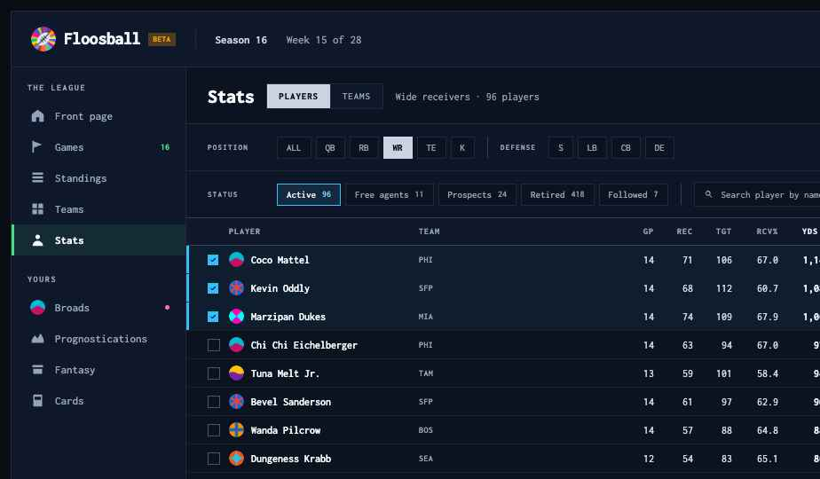
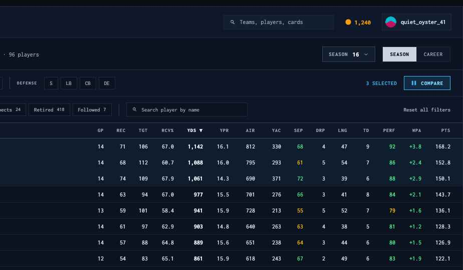
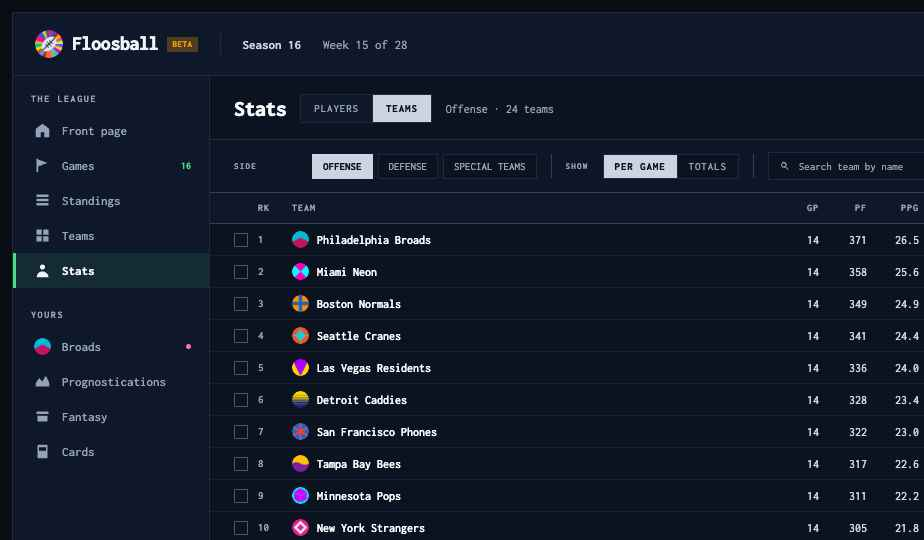
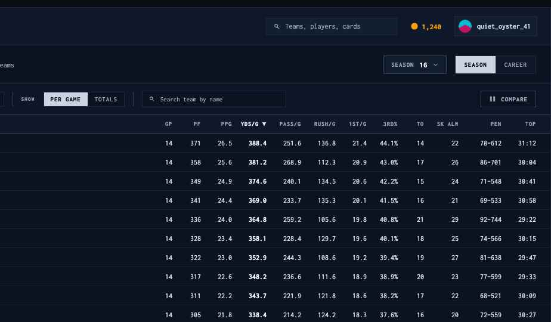
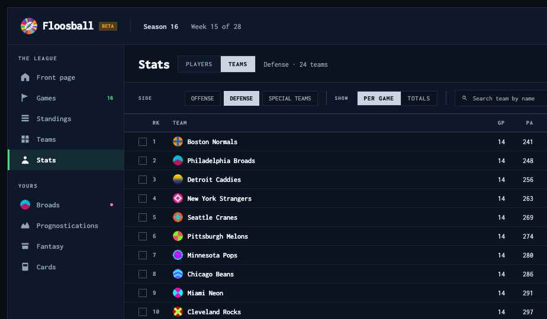
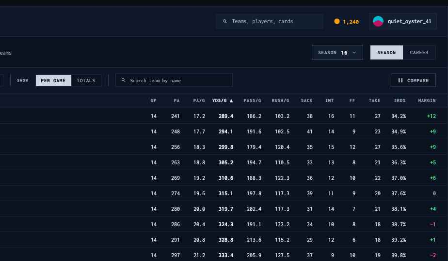

# Handoff: Stats page — one shell for players and teams (concept 2)

## Overview

`PlayersPage.tsx` today renders a different table shape per position, no defensive stats, no season
selection, no career, and no team stats anywhere. This replaces it with **the league's stats page**:

1. A **PLAYERS / TEAMS** switch beside the title.
2. **One table shell** — one row height, one header, three column widths, one number style. The
   position filter (players) and the SIDE filter (teams) only swap *which* columns fill it.
3. **Defense as a peer of offense** — the position filter runs `ALL QB RB WR TE K`, then a rule,
   then `S LB CB DE`, and picking a defensive position swaps to the defensive column set.
4. **Season and career as two controls** — a season picker plus a `SEASON / CAREER` toggle.
5. Row-tick selection plus a toolbar **Compare** button.

Deliberately **not** here: leaders bands, MVP rankings, Hall of Fame, awards. This page is stats.
`PlayerLeaders` and `MvpRankings` stay where they are.

**Target:** rewrite `src/Views/Players/PlayersPage.tsx` in place and re-route it as the Stats page
(the left-nav item is relabelled `Stats`). Keep its existing fetch, `PlayerListItem` and `ColDef`
patterns; replace the presentation layer and extend the data contract per **Data** below.

## About the design files

`prototype/Player Stats.dc.html` is a **design reference created in HTML** — intended look and
behaviour, not production code. One static file, fixture data, inline styles.

Open it in a browser (no server needed). Ship the **turn 2** screens: `2a` (players), `2b` (teams ·
offense), `2c` (teams · defense). Turn 1 below them is earlier exploration — a `1a` toolbar variant
and a `1b` left-rail variant, both carrying a leaders band that has since been cut. **Ignore turn 1.**

The Floosball header, the beta chip and the 196px left sidebar are a **mock of app chrome that
already exists** (`Navbar`, sidebar). Do not rebuild them — but do relabel the nav item to `Stats`.

## Fidelity

**High-fidelity.** Colours, type sizes, weights, spacing and interaction states below are final.

The one thing that is *not* a design decision is the **stat colour ramps** — they are the ones the
sim already uses in `PlayInsightsPanel.tsx`, and they must stay in sync with it:

| Ramp | Thresholds | Applies to |
| --- | --- | --- |
| `attrColor` | `≥80 → #4ade80`, `≥70 → #eab308`, else `#f87171` | player ratings (PERF) |
| `qualityColor` | `≥65 → #4ade80`, `≥40 → #eab308`, else `#f87171` | 0–100 quality metrics (SEP) |
| delta | `+ → #4ade80`, `− → #f87171`, `0 → #94a3b8` | WPA, turnover margin |

Every other number is `#cbd5e1`; the sorted column is `#f1f5f9` at weight 700. **Do not colour a
stat that has no ramp** — the table is dense and colour has to mean one thing.

---

## Screens / Views

One route, two modes. Suggested path `/stats`, with `/players` redirecting to it.

Page shell: existing app chrome, then a `flex column` content area. All content padding is `24px`
horizontal.

### 1. Title row

`display: flex; align-items: center; gap: 14px; padding: 17px 24px 15px;
border-bottom: 1px solid #1e293b`.

- `Stats` — `22px / 800 / −0.025em / #f8fafc`, `margin: 0`.
- **PLAYERS / TEAMS segmented control** — `background: #0f172a`, `border: 1px solid #1e293b`,
  segments `padding: 8px 13px`, `11px`, `letter-spacing: 0.08em`, `border-left: 1px solid #1e293b`
  between them. Active: `800`, `#0b1220` on `#cbd5e1`. Inactive: `500`, `#94a3b8`, transparent.
  **This is the shell's one segmented control** — the same object appears as SEASON/CAREER and as
  the teams PER GAME/TOTALS toggle. Build it once.
- Context line — `12px / 400 / #94a3b8`, e.g. `Wide receivers · 96 players` / `Offense · 24 teams`.
- `flex: 1` spacer.
- **Season picker** — plate: `background: #131e2f`, `border: 1px solid #334155`, `padding: 8px 12px`;
  `SEASON` label `11px/700/0.08em/#94a3b8`, value `13px/800/#e2e8f0` tabular, chevron `11px`.
  Opens the season list (S1…S16 plus `All seasons`).
- **SEASON / CAREER segmented control**, same object as above. In `CAREER` the season picker
  disables and a `TOTALS / PER GAME` control appears beside it (career averages).

### 2a. Players view




**Filter bar, row 1** — `padding: 12px 24px`, `background: #0d1526`,
`border-bottom: 1px solid #1e293b`, `display: flex; align-items: center; gap: 14px; flex-wrap: wrap`.

- `POSITION` label — `9px/700/0.14em/#94a3b8`, `width: 64px`.
- Position pills, `gap: 5px`: `padding: 6px 10px`, `11px`. Inactive `500`, `#94a3b8`,
  `background: #0b1220`, `border: 1px solid #1e293b`. Active `800`, `#0b1220`, `background: #cbd5e1`,
  `border: 1px solid #cbd5e1`. Order `ALL QB RB WR TE K`.
- `1px × 24px` `#334155` rule, then a `DEFENSE` label, then `S LB CB DE` in the same pills.
  **One filter, two groups** — selecting a defensive position deselects the offensive one and swaps
  the column set.
- `flex: 1` spacer, then the selection count (`11px/600/0.06em/#38bdf8`, `N SELECTED`) and the
  **Compare** button — `background: rgba(56,189,248,0.12)`, `border: 1px solid #38bdf8`,
  `padding: 7px 13px`, icon `12px` `#38bdf8`, label `11px/800/0.08em/#7dd3fc`. With nothing selected
  the button is inert: `background: #0b1220`, `border: 1px solid #334155`, label `#94a3b8`, and the
  count is hidden.

**Filter bar, row 2** — same padding and background, `border-bottom: 1px solid #334155` (the heavier
rule closes the filter block).

- `STATUS` label, then status chips carrying counts: `padding: 6px 10px`, label `11px`, count
  `10px/500` tabular in the same span. Selected chip: `#e2e8f0` on `rgba(56,189,248,0.12)`,
  `border: 1px solid #38bdf8`, count `#7dd3fc`. Order `Active`, `Free agents`, `Prospects`,
  `Retired`, `Followed`.
- Rule, then the **player search** — `background: #0b1220`, `border: 1px solid #1e293b`,
  `padding: 7px 10px`, `width: 220px`, magnifier `12px` `#94a3b8`, placeholder `11px/400/#94a3b8`.
- `flex: 1` spacer, then `Reset all filters` — `11px/600/#94a3b8`.

**Table header** — `padding: 0 24px`, `background: #0f172a`, `border-bottom: 1px solid #334155`.
Cells `10px/700/0.1em/#94a3b8`, `padding: 10px 0`, numeric columns right-aligned. The sorted column
is `800` `#e2e8f0` with `▼` / `▲` appended. Clicking a header sorts; clicking the sorted one flips.

**Row** — `display: flex; align-items: center; padding: 0 24px;
border-bottom: 1px solid #16202f`. Hover `background: rgba(255,255,255,0.04)`. Selected:
`background: rgba(56,189,248,0.07)` + `box-shadow: inset 3px 0 0 #38bdf8`.

| Cell | Width | Style |
| --- | --- | --- |
| Checkbox | 24px | `12×12`; unchecked `border: 1px solid #475569`; checked `background: #38bdf8` + `#0b1220` tick |
| Player | 214px | avatar `17×17` round + name link `12px/600/#f8fafc`, ellipsised, `padding: 7px 0` |
| Team | 52px | abbr `10px/600/0.04em/#94a3b8` — **neutral, not the team colour**; the avatar carries team identity |
| (spacer) | `flex: 1` | absorbs slack so the stat block stays right-aligned |
| Stat columns | see below | `12px/500/#cbd5e1`, right, `font-variant-numeric: tabular-nums` |

**Column widths — the three sizes, and the whole point of the shell:**

- **44px** — counts (`GP REC TGT SEP DRP LNG TD`)
- **52px** — rates and ratings (`RCV% YPR AIR YAC PERF WPA`)
- **58px** — volume and totals (`YDS PTS`)

**Column sets by position** (`GP` always first):

| Position | Columns |
| --- | --- |
| ALL | `GP` · `PERF` · `WPA` · `PTS` · plus a `STAT LINE` text column (reuse `Fantasy/playerStatLine.tsx`'s `compactStatLine`) |
| QB | `GP CMP ATT CMP% YDS TD INT SACK AIR PERF WPA PTS` |
| RB | `GP CAR YDS YPC TD FUM REC RECYDS PERF WPA PTS` |
| WR / TE | `GP REC TGT RCV% YDS YPR AIR YAC SEP DRP LNG TD PERF WPA PTS` |
| K | `GP FGM FGA FG% LNG XPM XPA PERF PTS` |
| S / LB / CB / DE | `GP TKL TFL SACK INT PD FF FR TD DEFRTG WPA` |

`ALL` is the position filter's hardest case and the reason today's page feels inconsistent: mixed
positions can't share a box score. Giving `ALL` universal columns plus one compact stat-line string
keeps the shell identical instead of degrading it.

**Footer** — `padding: 13px 24px`: `Showing N of M {position}` (`11px/400/#94a3b8`), spacer,
`LOAD MORE` chip (`border: 1px solid #334155`, `padding: 7px 14px`, `11px/700/0.06em/#cbd5e1`).
Infinite scroll is fine as an alternative; keep the count line either way.

### 2b / 2c. Teams view




Identical shell. One filter row (teams need no status facet):

- `SIDE` label + pills `OFFENSE` / `DEFENSE` / `SPECIAL TEAMS`.
- Rule, `SHOW` label + `PER GAME` / `TOTALS` segmented control.
- Rule, **team search**, `width: 220px`.
- Spacer, Compare button (same object).

Row gains a **rank** cell — `width: 34px`, `11px/600/#94a3b8` tabular — between the checkbox and the
team name. Team name cell is `240px`.

**Offense columns:** `GP`(44) `PF`(48) `PPG`(52) `YDS/G`(58) `PASS/G`(58) `RUSH/G`(58) `1ST/G`(52)
`3RD%`(52) `TO`(44) `SK ALW`(58) `PEN`(72) `TOP`(58). Default sort `YDS/G` desc.




**Defense columns:** `GP`(44) `PA`(48) `PA/G`(52) `YDS/G`(58) `PASS/G`(58) `RUSH/G`(58) `SACK`(48)
`INT`(44) `FF`(44) `TAKE`(52) `3RD%`(52) `MARGIN`(62). Default sort `YDS/G` **asc** (fewest allowed
first) — note the `▲`. `MARGIN` is the only coloured cell: signed green/red.

**Special teams** is stubbed in the pill group and not yet designed. Proposed set:
`GP FGM FGA FG% LNG XPM XP% PUNTS NET AVG TB IN20 KR AVG PR AVG`. Confirm which of these the sim
actually tracks before building.

---

## Interactions & Behavior

- **Sorting.** Every stat column sorts. Sort persists across a position change **when the column
  exists in the new set**; otherwise fall back to that position's default (the current page resets
  to fantasy points every time, which is one of the things that makes it feel jumpy).
- **Selection.** Row checkboxes, max 4. The count and Compare button live in the filter bar. Compare
  opens a full-screen comparison view (not designed here — treat as a follow-up).
- **Switching PLAYERS ↔ TEAMS** keeps season and career scope; everything else resets.
- **Career mode.** The season picker disables; `TOTALS / PER GAME` appears. Career rows show
  `SEASONS` in place of `GP` for players. Retired players are included in career mode by default.
- **Hover.** Rows `rgba(255,255,255,0.04)`; headers brighten to `#e2e8f0`; plates take
  `border-color: #475569`, `background: #1b2739`.
- **Focus.** `outline: 2px solid #38bdf8; outline-offset: 2px` on every control. Never the default.
- **Empty / loading.** Skeleton 14 rows at final height; never collapse the layout. Empty filter
  result keeps the header and shows one centred line at `#cbd5e1`.
- **Responsive.** Designed at 1440px. Below ~1180px the stat block scrolls horizontally with the
  player/team cell pinned (`position: sticky; left: 0`). Below ~760px drop to the position's four
  headline stats and put the rest behind a row expand.

## State Management

Page-local, all in the view:

```ts
mode:      'players' | 'teams'
scope:     { kind: 'season'; season: number } | { kind: 'career'; per: 'total' | 'game' }
position:  'ALL'|'QB'|'RB'|'WR'|'TE'|'K'|'S'|'LB'|'CB'|'DE'   // players
side:      'offense' | 'defense' | 'special'                   // teams
teamRate:  'perGame' | 'totals'                                // teams
status:    'active'|'fa'|'prospects'|'retired'|'followed'      // players
search:    string
sortKey:   string
sortAsc:   boolean
selected:  Set<number>    // player or team ids, max 4
```

Auth from `useAuth()` (the `Followed` facet). No new context.

---

## Data

This is where most of the work is. **Bold** rows below do not exist today.

### What exists

| Endpoint | Returns | Used for |
| --- | --- | --- |
| `GET /api/players?status=&position=` | `PlayerListItem[]` with `currentStats` | the players table, current season only |
| `GET /api/players/:id` | `{ stats: SeasonRow[], allTimeStats }` | per-player season rows + career — **proves the data exists per player, just not in the list** |
| `GET /api/stats/leaders?position=&category=&limit=` | ranked leaders; categories include `performance_rating` | **proves `performance_rating` is computed** |

Today's `currentStats` (from `PlayersPage.tsx`):

```ts
interface CurrentStats {
  fantasyPoints: number
  gamesPlayed: number
  passing:   { comp, att, compPerc, yards, tds, ints, ypc }
  rushing:   { carries, yards, ypc, tds, fumblesLost }
  receiving: { receptions, targets, rcvPerc, yards, ypr, tds }
  kicking:   { fgs, fgAtt, fgPerc }
}
```

Per-game defensive stats already exist on the WS payload (`PlayerBase.defense` in
`types/websocket.ts`): `{ sacks, ints, tackles, tfl, forcedFumbles, passBreakups }`. Per-game team
stats exist as `TeamGameStats`: `{ passYards, passComp, passAtt, passTds, passInts, rushYards,
rushCarries, rushTds, totalYards, turnovers, sacks, firstDowns, totalPlays, thirdDownConv,
thirdDownAtt, fourthDownConv, fourthDownAtt }`. **Neither is aggregated to a season anywhere.**

### What the page needs

#### A. `GET /api/stats/players`

Replaces the list call. Query: `season` (number | `career`), `per` (`total`|`game`, career only),
`position`, `status`, `search`, `sort`, `dir`, `limit`, `offset`.

```ts
interface StatsPlayerRow {
  id: number
  name: string
  position: string                 // offensive slot
  defensivePosition: string | null // S | LB | CB | DE  — drives the defensive filter
  teamId: number | null
  teamAbbr: string | null
  teamColor: string | null         // for the avatar/border only, never small text
  status: 'active' | 'fa' | 'prospect' | 'retired'
  playerRating: number
  ratingStars: number

  gamesPlayed: number
  seasonsPlayed?: number           // career mode only
  fantasyPoints: number

  // ── existing shapes, unchanged ──
  passing:   { comp, att, compPerc, yards, tds, ints, ypc }
  rushing:   { carries, yards, ypc, tds, fumblesLost }
  receiving: { receptions, targets, rcvPerc, yards, ypr, tds }
  kicking:   { fgs, fgAtt, fgPerc }

  // ── NEW: advanced receiving (sim already computes these per play) ──
  receivingAdv: {
    airYards: number      // sum of PlayInsightsPass.airYards on completions
    yac: number           // sum of PlayInsightsPass.yac
    separation: number    // 0-100, mean of PlayInsightsTarget.openness when selected
    drops: number
    longest: number
  }

  // ── NEW: advanced passing ──
  passingAdv: {
    airYards: number
    sacksTaken: number
    longest: number
  }

  // ── NEW: season-aggregated defence (per-game shape already exists) ──
  defense: {
    tackles: number
    tfl: number
    sacks: number
    ints: number
    passesDefended: number   // = passBreakups, aggregated
    forcedFumbles: number
    fumbleRecoveries: number
    defensiveTds: number
    rating: number           // 0-100, the player's defensive rating
  }

  // ── NEW: impact ──
  impact: {
    performanceRating: number  // 0-100 — already a leaders category, expose it per row
    wpa: number                // summed win-probability added, signed, percentage points
    clutchPlays: number        // count of plays flagged isClutchPlay
    chokePlays: number
    bigPlays: number
  }
}
```

Notes for whoever builds it:

- `receivingAdv` / `passingAdv` are **derivable from data the sim already emits** —
  `PlayInsightsPass.airYards`, `.yac`, and `PlayInsightsTarget.openness` are on every pass play's
  insights payload (`types/websocket.ts`). They are not persisted as season aggregates. Confirm
  whether play insights are stored per play or discarded after broadcast; if discarded, these need
  a season accumulator on the sim side, not a query.
- `impact.wpa` should be the same quantity the game feed uses for its big-play marker
  (`play.homeWpa` / `play.awayWpa`), summed for plays the player was involved in. Decide and
  document the attribution rule (passer + receiver both credited? split?) — the design shows one
  number per player and doesn't care which rule, but it must be one rule.
- `impact.clutchPlays` / `chokePlays` come from `play.clutchPerformers` / `chokePerformers`.
- **`separation`, `drops`, `longest`, `defense.rating`, and everything in `impact` are the fields
  most likely to need new persistence.** If any can't be delivered, hide that column rather than
  shipping a zero — a dense table full of `0`s is worse than a narrower one.

#### B. `GET /api/stats/teams`

Entirely new. Query: `season`, `side` (`offense`|`defense`|`special`), `per` (`game`|`total`).

```ts
interface StatsTeamRow {
  teamId: number
  name: string          // "Philadelphia Broads"
  abbr: string
  color: string
  gamesPlayed: number

  offense: {
    pointsFor: number
    pointsPerGame: number
    totalYards: number
    yardsPerGame: number
    passYardsPerGame: number
    rushYardsPerGame: number
    firstDownsPerGame: number
    thirdDownPct: number        // 0-100
    fourthDownPct: number
    turnovers: number
    sacksAllowed: number
    penalties: number           // count
    penaltyYards: number
    timeOfPossession: string    // "31:12" — mm:ss, per game
  }

  defense: {
    pointsAgainst: number
    pointsAllowedPerGame: number
    yardsAllowedPerGame: number
    passYardsAllowedPerGame: number
    rushYardsAllowedPerGame: number
    sacks: number
    ints: number
    forcedFumbles: number
    takeaways: number           // ints + fumble recoveries
    thirdDownPctAllowed: number
    turnoverMargin: number      // signed
  }

  special?: { /* see Special teams above — confirm what the sim tracks */ }
}
```

`offense` maps almost 1:1 onto a season sum of `TeamGameStats`, with three gaps:
**`penalties` / `penaltyYards`** (on `api.ts`'s `TeamGameStats` but not the WS one — confirm the sim
records them), **`sacksAllowed`** (the sim records `sacks` *by* a defence; the allowed side is the
opponent's number and may just need the join), and **`timeOfPossession`** (present on `api.ts`'s
shape as a string; confirm it's persisted per game).

`defense` is almost entirely **the opponent's offensive line, joined** — `pointsAllowedPerGame`,
`yardsAllowedPerGame`, `pass/rushYardsAllowedPerGame` and `thirdDownPctAllowed` all fall out of
summing opponents' `TeamGameStats`. Only `takeaways` and `turnoverMargin` need deriving.

#### C. Facet counts

The status chips show counts (`Active 96`, `Retired 418`, …). Either return them alongside the rows:

```ts
{ rows: StatsPlayerRow[], total: number, facets: { active: number, fa: number, prospects: number, retired: number, followed: number } }
```

or accept a second lightweight call. Counts must reflect the *current* position filter, not the
whole league.

---

## Design Tokens

| Token | Value | Use |
| --- | --- | --- |
| Page background | `#0b1220` | table body, control interiors |
| Filter bar | `#0d1526` | both filter rows |
| Surface | `#131e2f` | season picker plate |
| Chrome | `#0f172a` | table header, segmented controls |
| Border | `#1e293b` | control borders, section rules |
| Border faint | `#16202f` | table row rules |
| Border strong | `#334155` | filter block close, header underline, rules between groups |
| Border hover | `#475569` | plate hover, unchecked checkbox |
| Active segment | `#cbd5e1` bg / `#0b1220` text | selected pill or segment |
| Text primary | `#f8fafc` / `#f1f5f9` | names, sorted column |
| Text body | `#cbd5e1` | stat cells |
| Text secondary | `#94a3b8` | labels, headers, team abbr — **the floor for readable text** |
| Selection | `#38bdf8`, fill `rgba(56,189,248,0.07)`, chip bg `rgba(56,189,248,0.12)`, chip text `#7dd3fc` | checkboxes, selected rows, Compare |
| Good / bad / mid | `#4ade80` / `#f87171` / `#eab308` | the ramps in **Fidelity** |

Type — one family, `font-pixel` (`pressStart` / Inconsolata, already global):

| Role | Size / line-height / weight / tracking |
| --- | --- |
| Page title | 22 / 1 / 800 / −0.025em |
| Stat cell | 12 / 1 / 500 (tabular); sorted column 700 |
| Player / team name | 12 / 1 / 600 |
| Segment, pill | 11 / 1 / 500, active 800 / 0.08em |
| Status chip count, rank, team abbr | 10–11 / 1 / 500–600 |
| Column header | 10 / 1 / 700 / 0.1em, sorted 800 |
| Filter group label | 9 / 1 / 700 / 0.14em |

Spacing: `5, 6, 7, 8, 10, 12, 13, 14, 17, 24` px. Row `padding: 7px 0` on the name cell sets the
~31px row height — every row in every mode is that height. **Radius 0 everywhere** except avatars
(`50%`). No shadows; the one `inset 3px` rule marks selection.

## Conformance notes

1. `#64748b` and `#475569` are below the repo's readable-text floor (`CLAUDE.md`) and appear here
   only as borders. Every readable string bottoms out at `#94a3b8`.
2. Team brand colours are never used for small text — the team abbr is `#94a3b8` and the avatar
   carries identity. (This is a change from the game page, where two teams need distinguishing; in a
   24-team table, 24 brand colours is noise.)
3. No emoji. Chevrons, magnifiers, ticks and the compare glyph are inline SVG.

## Files

- `prototype/Player Stats.dc.html` — the design. Ship `2a`, `2b`, `2c`; ignore turn 1.
- `prototype/assets/`, `prototype/support.js` — what the prototype needs to open.
- `screenshots/01-players-left.png`, `02-players-right.png` — the players view, both halves.
- `screenshots/03-teams-offense-left.png`, `04-teams-offense-right.png` — teams · offense.
- `screenshots/05-teams-defense-left.png`, `06-teams-defense-right.png` — teams · defense.

In the target repo:

- `src/Views/Players/PlayersPage.tsx` — **rewrite in place**, re-route as `/stats`.
- `src/Components/PlayInsightsPanel.tsx` — lift `attrColor` / `qualityColor` into a shared helper;
  both files must use the same one.
- `src/Components/Fantasy/playerStatLine.tsx` — `compactStatLine` for the `ALL` position stat line.
- `src/types/websocket.ts` — `PlayerBase.defense`, `TeamGameStats`, `PlayInsightsPass`,
  `PlayInsightsTarget` are the per-game shapes the new season aggregates derive from.
- `src/types/api.ts` — extend with `StatsPlayerRow` / `StatsTeamRow`.
- Navigation — relabel the `Players` item to `Stats`.
- `CLAUDE.md` — house conventions. Update if this page changes anything documented there.
